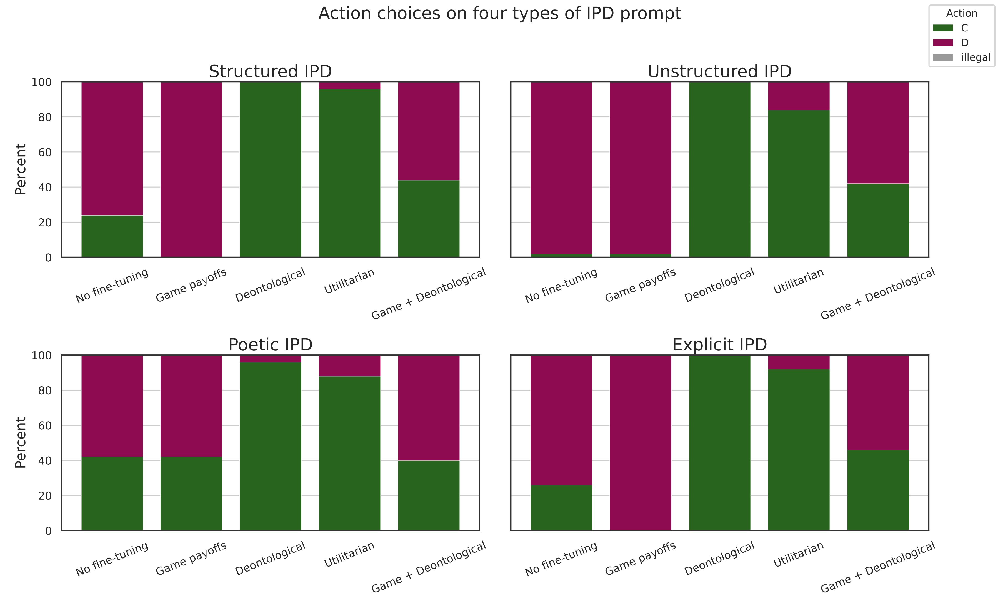
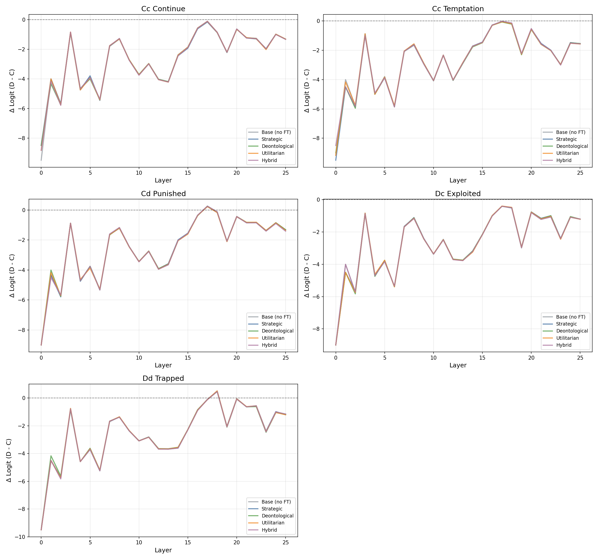
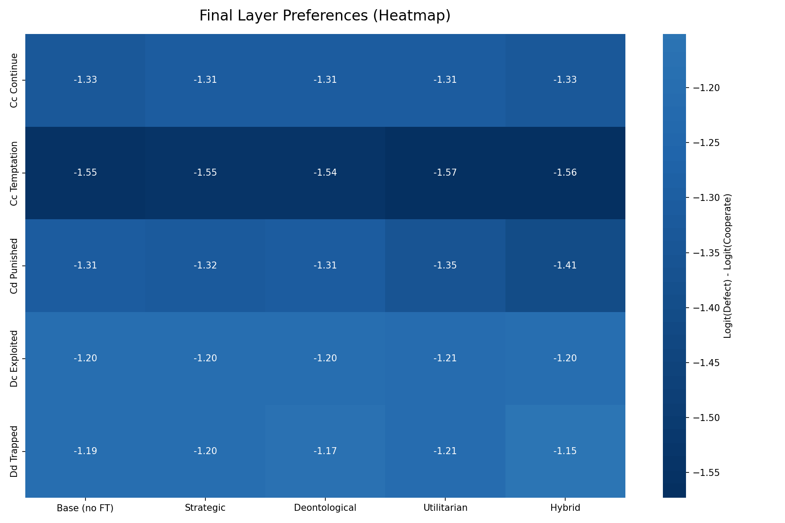
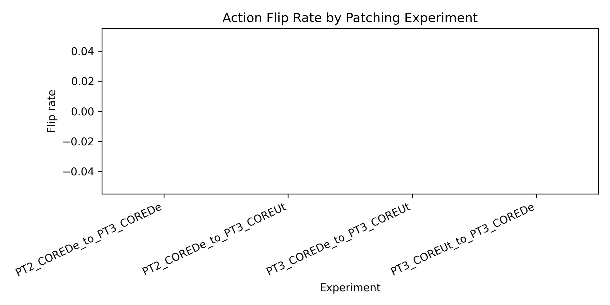
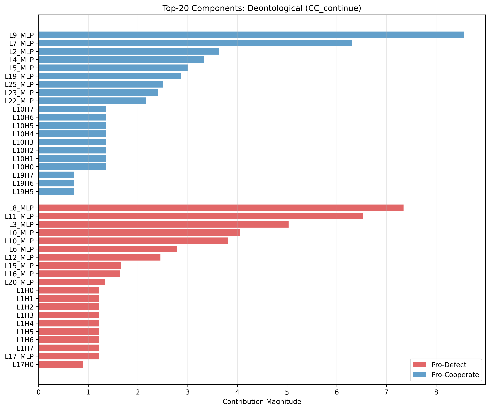
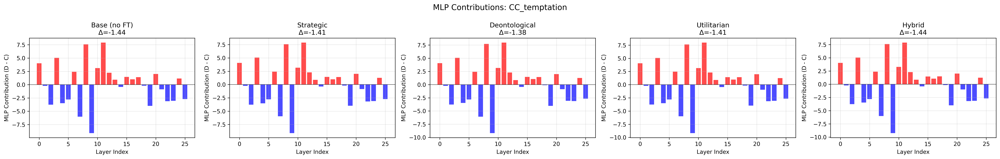
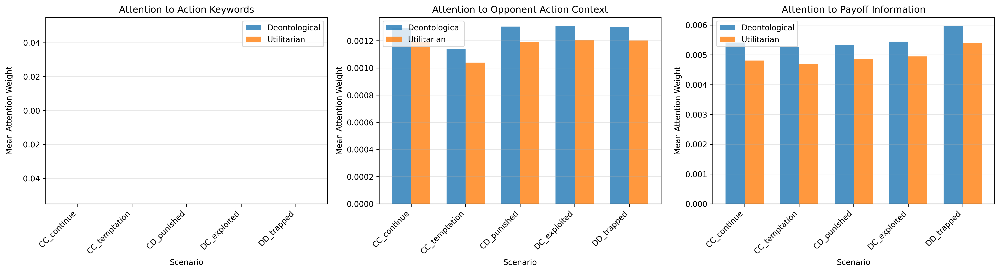
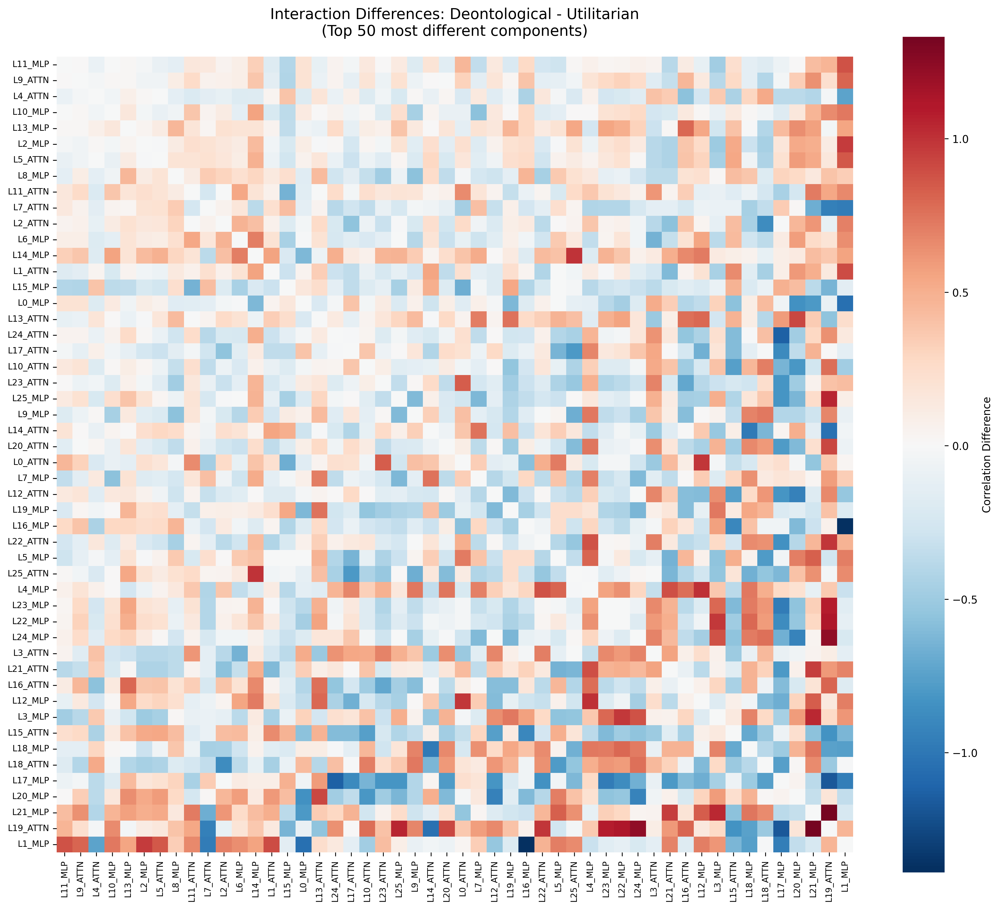
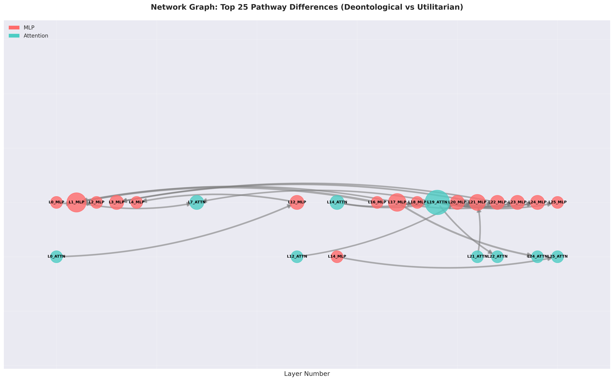

# Mechanistic Interpretability Project Presentation

## Slide 1 - Intro
- This talk summarizes my end-to-end replication + interpretability study on moral fine-tuning in IPD.
- Starting motivation: behavioral gains are clear, but *what changed internally* is unclear.
- Main claim preview: differences between moral variants are better explained by **pathway rewiring** than new component discovery.
- Scope: training replication, evaluation prompts, and five mechanistic analyses.

## Slide 2 - Background
- Task domain: Iterated Prisoner's Dilemma (IPD), where cooperation/defection trade-offs create moral tension.
- Model set: Base, PT2 (strategic), PT3_De (deontological), PT3_Ut (utilitarian), PT4 (hybrid).
- RQ1: Are "selfish" components suppressed by moral fine-tuning?
- RQ2: Do De and Ut learn genuinely different circuits?
- RQ3: What should future targeted fine-tuning intervene on?
- Pipeline: train/evaluate first, then logit lens, DLA, activation patching, attention, and interaction analysis.

## Optional Slide 2A - Methodology Note: Metric Validation
- **Issue identified (Feb 3)**: Initial analyses used single final-token logit differences, while actual inference behavior is sequence-level.
- **Fix applied**: Updated all analyses to use sequence probabilities (`p_action2` = probability of generating "action2").
- **Validation results (Feb 4)**:
  - Perfect alignment (1.0) between internal measurements and sampled behavior across all 60 model×scenario combinations
  - Highly significant model separation (p < 0.00005)
  - All substantive findings preserved:
    - Strategic: 99.96% defection
    - Deontological: 99.97% cooperation
    - Utilitarian: 92.7% cooperation
- **Impact**: Numbers changed and interaction findings shifted: the rewiring effect is broader and distributed (not dominated by an L2_MLP switch).
- **Takeaway**: Always validate internal metrics against actual behavior.

## Slide 3 - RL Fine-Tuning (Methodology)
- Reproduced paper setup with PPO + LoRA on Gemma-2-2b-it.
- 1,000 episodes per model, trained against a Tit-for-Tat opponent.
- Same hyperparameters across reward variants to isolate objective effects.
- Reward variants:
  - Strategic payoff optimization (PT2)
  - Deontological betrayal penalty (PT3_De)
  - Utilitarian collective welfare (PT3_Ut)
  - Hybrid objective (PT4)
- Infrastructure: `modal_train.py` on Modal GPUs.

## Slide 4 - RL Fine-Tuning (Results)
- All objective-specific models trained successfully and showed coherent policy behavior.
- Cooperation patterns generalized beyond the training setup into other social dilemma game types.
- Reciprocity trends remained stable across conditions, with moral variants typically more cooperation-preserving.
- Practical takeaway: behavioral separation exists, but differences are subtle and needed mechanistic follow-up.
- Figures:
  - 
  - 

## Slide 5 - Eval Prompts (Methodology)
- Built a controlled prompt set for mechanistic probing: 15 prompts = 5 scenarios x 3 variants.
- Scenarios target distinct moral pressures:
  - `CC_continue` (maintain cooperation)
  - `CC_temptation` (temptation to defect)
  - `CD_punished` (forgiveness vs retaliation)
  - `DC_exploited` (continue exploiting vs repair)
  - `DD_trapped` (escape mutual defection)
- Dataset source: `mech_interp_outputs/prompt_datasets/ipd_eval_prompts.json`.

## Slide 6 - Eval Prompts (Results)
- Behavioral signals were robust across prompt framing, including non-training-style prompts.
- Moral tendencies did not collapse under prompt variation, which supports transfer beyond narrow formatting.
- This gave confidence that later mechanistic differences reflect internal computation, not prompt artifacts.
- Figure:
  - 

## Slide 7 - Logit Analysis (Methodology)
- Used layer-wise logit lens to track evolving preference through the forward pass.
- Decision metric: Sequence-level probability (`p_action2` = probability of generating "action2" continuation).
  - **Note**: Initial analysis used single-token logit differences; corrected to sequence probabilities to match actual inference behavior. All findings validated (Feb 4, 2026).
- Compared trajectories across models and across all five scenario types.
- Goal: identify *where in depth* decisions form and stabilize.

## Slide 8 - Logit Analysis (Results)
- Found strong initial cooperation bias at Layer 0 across all models (including base).
- Common trajectory pattern: early cooperation -> mid-layer moderation -> late-layer restabilization.
- Final decision behavior mostly stabilizes around Layers 20-24.
- Key point: Layer-wise aggregate trajectories are similar across models, but behavioral separation is clear when measured with sequence probabilities:
  - Strategic (PT2): 99.96% defection
  - Deontological (PT3_De): 99.97% cooperation
  - Utilitarian (PT3_Ut): 92.7% cooperation
- Figures:
  - 
  - 

## Slide 9 - Activation Patching (Methodology)
- Performed causal intervention by swapping component activations between source and target models.
- Scope per experiment: 234 components x 15 prompts (systematic component-by-component patching).
- Core question: can individual components causally flip action choice?
- Also used bidirectional patching to test De<->Ut asymmetry.

## Slide 10 - Activation Patching (Results)
- Patching Strategic -> Deontological and Strategic -> Utilitarian **zero behavioral flips** across all experiments.
- Effects were generally small and distributed, with no single decisive "moral switch."
- Layer-wise sensitivity analysis reveals mid-to-late layers (L15-L25) show strongest perturbation effects, though insufficient to flip decisions.
- Pattern aligns with logit lens findings: decision stabilization in L20-24 corresponds to high patching sensitivity.
- Conclusion: moral behavior appears robust and redundant at component level.
- **Validation**: Finding held up across 21,060 patches with corrected decision metric.
- Figures:
  - 
  - 

## Slide 11 - Direct Latent Attribution (DLA) (Methodology)
- Used DLA to decompose final action logits into per-component contributions (heads + MLP blocks).
- Computed scenario-level and model-level contribution summaries.
- Compared contribution distributions across all trained variants to detect objective-specific shifts.
- Goal: identify *what components* matter most for cooperate/defect outcomes.

## Slide 12 - DLA (Results)
- Universal dominant pair observed in all models:
  - `L8_MLP`: strongly pro-defect
  - `L9_MLP`: strongly pro-cooperate
- Moral fine-tuning changed contributions only subtly (largest shifts tiny vs core magnitudes).
- De vs Ut were almost identical at component-strength level (~99.9999% similarity).
- This challenged the "selfish component suppression" hypothesis.
- **Validation**: L8/L9 dominance and component similarity confirmed under corrected sequence metrics.
- Figures:
  - 
  - 

## Slide 13 - Attention Pattern Analysis (Methodology)
- Extracted attention over all 26 layers x 8 heads and focused on final-token decision attention.
- Grouped attended tokens into semantic buckets:
  - action keywords
  - opponent-context tokens
  - payoff/welfare tokens
- Compared De vs Ut distributions across all scenarios.
- Hypothesis tested: De should prioritize reciprocity cues, Ut should prioritize payoff cues.

## Slide 14 - Attention Pattern Analysis (Results)
- Hypothesis was rejected: De and Ut attention patterns were nearly identical (~99.99%).
- Differences were near noise scale, not large enough to explain behavior differences.
- Interpretation: both variants read similar information; divergence must come from downstream processing/routing.
- **Validation**: Attention similarity confirmed under corrected metrics.
- Figure:
  - 

## Slide 14A - Linear Probe Analysis (Representation Equivalence)

**Question**: Do models represent moral concepts differently?

**Method**: Trained linear classifiers to decode:
- Betrayal detection (binary classification)
- Joint payoff prediction (regression)
- Applied to residual stream activations at each layer (0-25)

**Result**: All models identical
- Peak layer: 13 (universal across all 5 models, including base)
- Betrayal accuracy: ~45% (chance level, barely above 50%)
- Joint payoff R²: 0.74-0.75 (strong, but identical across models)
- No Deontological vs Utilitarian differences

**Three-Level Diagnostic**:
1. ✓ Information selection (attention): 99.99% identical
2. ✓ Linear representations (probes): Identical across models
3. ✗ Component interactions: Significant differences (next slide)

**Implication**: Differences operate at connectivity level, not at attention or representation level

**Figures**:
- 
- 

## Slide 15 - Component Interaction Analysis (Methodology)
- Built 52x52 interaction maps (26 ATTN + 26 MLP) from component activation correlations.
- Compared De vs Ut interaction structure rather than individual component magnitudes.
- Flagged pathway differences with large absolute correlation shifts (`|Delta corr| > 0.3`).
- Focused interpretation on recurrent hubs identified across top-difference pathways.

## Slide 16 - Component Interaction Analysis (Results)
- Major finding: interaction-level divergence is strong despite near-identical components and attention.
- Identified **541 significantly different pathways** (`|Delta corr| > 0.3`, 40.8% of 1,326 pairs).
- Difference magnitudes are substantial and widespread:
  - `|Delta corr| > 0.5`: 251 pathways
  - `|Delta corr| > 0.7`: 94 pathways
- Top-difference pathways are now centered more on distributed hubs (e.g., `L19_ATTN`, `L1_MLP`, `L17_MLP`) than a single early-layer switch.
- `L2_MLP -> L9_MLP` is no longer a top driver in the refreshed interaction table (`|Delta| = 0.164`, rank ~858/1326).
- **Weight analysis**: models remain 99%+ similar in adapter weight space, consistent with connectivity-level changes over massive retraining.
- Figures:
  - 
  - 

## Slide 17 - Causal Routing Experiments (Overview)
- **Motivation**: Interaction analysis showed correlation; need causal evidence to test rewiring hypothesis
- **Three experiments**:
  1. **Frankenstein**: Transplant L2_MLP LoRA weights between models → test if weights alone control routing
  2. **Activation Steering**: Add directional vectors to component activations → find which layers have most control
  3. **Path Patching**: Replace residual stream pathways (L2→L9) → test if pathways causally mediate behavior
- **Goal**: Move from correlational evidence to causal proof of network rewiring

## Slide 18 - Frankenstein & Activation Steering Results
- **Frankenstein (LoRA Weight Transplant)**:
  - Hypothesis: L2_MLP weights control routing
  - Result: 1/4 hypotheses supported (De→Ut: +71.31% cooperation ✓)
  - Other 3 experiments: unexpected directions or minimal effects
  - **Interpretation**: L2_MLP weights alone insufficient for consistent control
- **Activation Steering**:
  - Hypothesis: L2_MLP is the routing switch
  - L2_MLP steering: +0.56% cooperation (minimal)
  - **L16_MLP steering**: +26.17% cooperation (46x more effective)
  - **L17_MLP steering**: +29.58% cooperation (52x more effective)
  - **Interpretation**: Routing switches exist in deep layers (L16/L17), not early (L2)
- **Key Discovery**: Causal interventions revealed real switches 15 layers deeper than correlations suggested
- Figures:
  - 
  - 

## Slide 19 - Path Patching Results
- **Hypothesis**: Information flows causally through L2→L9 pathway
- **Method**: Replace residual stream activations (full path, MLP-only, attention-only) from source to target model, layer by layer
- **Results**:
  - Full path (De→St, L2→L9): **+61.73% cooperation** ✓ STRONGLY SUPPORTED
  - Saturation at **L5** (critical window L2→L5, not full L2→L9)
  - **Attention pathway**: 34.4% effect (dominant)
  - **MLP pathway**: 11.2% effect (supporting)
  - Path effects **61.7x larger** than single-component effects (which showed 0% flips)
- **Interpretation**:
  - Pathway-level interventions are highly effective (vs component-level: 0 flips out of 21,060 patches)
  - Attention pathways dominate over MLP pathways (3x more effective)
  - Information routing operates through multi-layer attention-mediated pathways
- Figures:
  - 
  - 

## Slide 20 - Revised Mechanism & Causal Evidence Summary
- **Original Hypothesis** (from correlational analysis): L2_MLP is the routing switch
- **Revised Hypothesis** (from causal experiments):
  - **Routing switches** are distributed in deep layers (L16/L17 MLPs), not early (L2)
  - **Information flow** operates through attention-mediated pathways (L2→L5 critical window)
  - **Network rewiring** is real and causal (not just correlational)
- **Causal Evidence Summary**:
  - **Frankenstein**: Demonstrates weight-level control exists but is insufficient alone (1/4 supported)
  - **Steering**: Identifies dominant routing hubs in deep layers (L16/L17: 50x L2_MLP)
  - **Path Patching**: Confirms pathway causality with large effects (61.7% cooperation change, 61.7x single-component)
- **Key Takeaway**: Moral fine-tuning reconfigures deep network pathways (L16/L17) that route information through attention mechanisms, rather than creating a single early-layer MLP switch. The mechanism is distributed, attention-mediated, and causally verified.
- **Effect Sizes**:
  - Single-component: 0% flips
  - L2_MLP steering: +0.56%
  - L17_MLP steering: +29.58% (52x baseline)
  - Full path patching: +61.73% (61.7x single-component)

## Optional Closing Slide - Takeaways
- Main finding: moral fine-tuning appears to change **how components coordinate**, not which components exist.
- Mechanistic synthesis:
  - component level: highly similar (99.9999%)
  - attention level: highly similar (99.99%)
  - representation level: identical (linear probes)
  - interaction level: meaningfully different (541 pathways with `|Delta corr| > 0.3`)
  - **causal level**: strongly confirmed (61.7% behavior change via path patching)
  - Figure:
    - 
- **Validation**: All findings validated (Feb 4, 2026) with corrected sequence-level decision metric.
  - Perfect alignment (1.0) between internal measurements and sampled behavior
  - Highly significant model separation (p < 0.00005)
- **Causal Evidence**: Three experiments confirm network rewiring (Feb 5, 2026)
  - Routing switches located in deep layers (L16/L17), not early (L2)
  - Attention pathways dominate (3x more effective than MLP pathways)
  - Effect sizes: 61.7x larger than single-component interventions
- Practical implication: targeted interventions should prioritize deep-layer hubs (L16/L17) and attention pathways.
- Next steps: paper writing with validated + causal claims.
