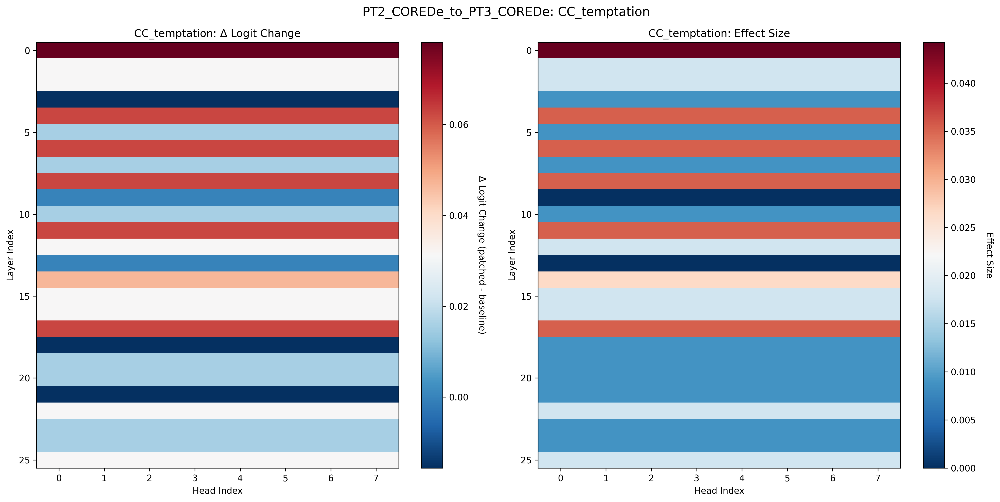
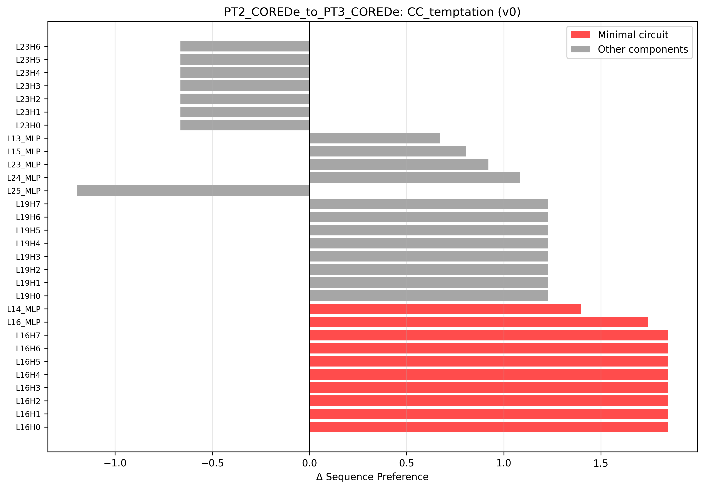

# Mechanistic Interpretability Project Presentation

## Slide 1 - Intro
- Goal: explain what I built and what we learned from mechanistic analysis of moral fine-tuning in IPD.
- Core claim: behavior differences are driven more by **rewiring** than by new components.
- Scope: RL fine-tuning reproduction + eval suite + 5 interpretability analyses.

## Slide 2 - Background
- Models: Base, PT2 (strategic), PT3_De (deontological), PT3_Ut (utilitarian), PT4 (hybrid).
- Research questions:
  - RQ1: Are selfish circuits suppressed?
  - RQ2: Do De and Ut develop distinct circuits?
  - RQ3: What should be targeted in future fine-tuning?
- Pipeline: train/eval first, then logit lens, DLA, patching, attention, interactions.

## Slide 3 - RL Fine-Tuning (Methodology)
- PPO + LoRA on Gemma-2-2b-it.
- 1,000 episodes/model against Tit-for-Tat.
- Controlled setup: same hyperparameters across reward variants.
- Infrastructure: `modal_train.py` on Modal GPUs.

## Slide 4 - RL Fine-Tuning (Results)
- All objectives learned successfully (strategic/moral/hybrid).
- Cooperation and reciprocity generalize beyond training game.
- Figures:
  - 
  - 

## Slide 5 - Eval Prompts (Methodology)
- Evaluation set: 15 prompts = 5 scenarios x 3 variants.
- Scenario coverage:
  - `CC_continue`, `CC_temptation`, `CD_punished`, `DC_exploited`, `DD_trapped`
- Dataset: `mech_interp_outputs/prompt_datasets/ipd_eval_prompts.json`

## Slide 6 - Eval Prompts (Results)
- Behavioral signals are consistent across prompt formats and scenarios.
- Moral behavior remains robust under prompt variation.
- Figure:
  - 

## Slide 7 - Logit Analysis (Methodology)
- Used layer-wise logit lens.
- Decision metric: `Delta logit = logit(Defect) - logit(Cooperate)`.
- Compared trajectories by model and scenario.

## Slide 8 - Logit Analysis (Results)
- Strong early cooperation bias (Layer 0) across all models.
- Late-layer stabilization (roughly Layers 20-24).
- Fine-tuned models show very similar trajectory shapes.
- Figures:
  - 
  - 

## Slide 9 - Activation Patching (Methodology)
- Causal intervention: patch activations between models component-by-component.
- Scale: 234 components x 15 prompts per experiment.
- Used to test whether specific components are load-bearing.

## Slide 10 - Activation Patching (Results)
- No behavioral flips in PT2 -> PT3_De / PT3_Ut patching.
- Effects are distributed and mostly small.
- Supports distributed moral encoding, not single-component control.
- Figures:
  - 
  - 

## Slide 11 - Direct Latent Attribution (DLA) (Methodology)
- Decomposed final action logits into per-component contributions.
- Compared head/MLP contribution structure across all trained variants.
- Used scenario-wise and model-wise aggregation.

## Slide 12 - DLA (Results)
- Universal dominant components: `L8_MLP` (pro-defect) and `L9_MLP` (pro-cooperate).
- Moral fine-tuning shifts are subtle relative to large base magnitudes.
- De vs Ut component similarity is extremely high (~99.9999%).
- Figures:
  - 
  - 

## Slide 13 - Attention Pattern Analysis (Methodology)
- Extracted attention across all 26 layers x 8 heads.
- Compared final-token attention to token categories:
  - action keywords
  - opponent context
  - payoff information
- De vs Ut comparison over all scenarios.

## Slide 14 - Attention Pattern Analysis (Results)
- Attention patterns are nearly identical (about 99.99% similarity).
- Differences are near noise scale; not enough to explain behavior gap.
- This rules out "different information selection" as the main mechanism.
- Figure:
  - 

## Slide 15 - Component Interaction Analysis (Methodology)
- Built correlation matrices over 52 layer-level components (26 ATTN + 26 MLP).
- Measured pathway-level differences between De and Ut.
- Highlighted large differences with `|Delta corr| > 0.3`.

## Slide 16 - Component Interaction Analysis (Results)
- Found strong wiring differences despite similar components and attention.
- 29 pathways differ significantly; key routing differences center on `L2_MLP`.
- Pathway differences align with cross-patching asymmetry (reported `r = 0.67`).
- Figures:
  - 
  - 

## Optional Closing Slide - Takeaways
- Main finding: moral fine-tuning appears to modify **information routing** more than component inventory.
- Practical implication: target pathways/interactions, not just broad layer blocks.
- Next step: convert this into paper figures + narrative for submission.
