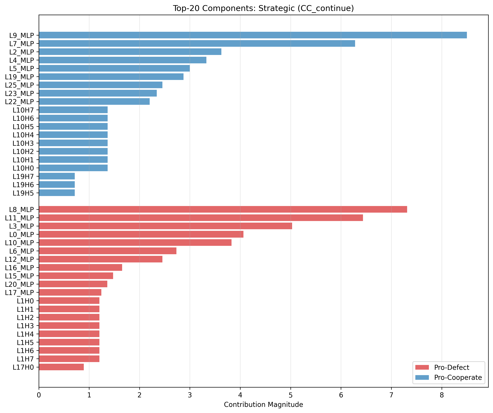

# Investigating How Moral Fine-Tuning Changes LLMs: A Journey Into Mechanistic Interpretability

## Background on Initial Paper

This project started with a paper called "[Moral Alignment for LLM Agents](https://arxiv.org/abs/2410.01639)" by Elizaveta Tennant, Stephen Hailes, and Mirco Musolesi (ICLR 2025). The paper explores a pretty interesting question: can you teach language models to be more cooperative by training them with moral reward signals?

The setup uses the classic **Iterated Prisoner's Dilemma** (IPD) game. If you're not familiar, here's the basic idea: two players can either cooperate or defect on each round. The payoffs work like this:

```
              Cooperate    Defect
Cooperate       3, 3       0, 4
Defect          4, 0       1, 1
```

The temptation is to defect (you get 4 points if they cooperate, while they get 0). But if both players defect, you both only get 1 point. The "best" outcome for everyone is mutual cooperation (both get 3), but it requires trust.

The researchers trained a language model (Gemma-2-2b-it, which has 2.2 billion parameters) to play this game using reinforcement learning. They tested three different reward schemes:

1. **Strategic** - Just the game payoffs (maximize your own score)
2. **Deontological** - Game payoffs plus a penalty (-3) for betraying someone who cooperated with you
3. **Utilitarian** - Maximize the *total* score (your score + opponent's score)

They trained the models against a Tit-for-Tat opponent (an agent that cooperates first, then copies whatever you did last turn). The training worked - the models learned to cooperate more.

But here's where it gets interesting: **what actually changed inside the model?** When you fine-tune a model to be more moral, are you suppressing "selfish" neurons? Creating new "moral" circuits? Changing what the model pays attention to?

That's the mystery I wanted to investigate using mechanistic interpretability - a set of techniques for looking inside neural networks to understand how they compute their outputs. This blog post walks through what I found.


## Experiments

### RL Fine-tuning Reproduction

#### Background + Methodology

To investigate what changes inside the models, I needed to train them myself. I replicated the paper's training setup as closely as I could, creating four different model variants (plus analyzing the base untrained model):

**The Models:**
- **Base** - Gemma-2-2b-it with no fine-tuning
- **PT2 (Strategic)** - Trained with just the game payoffs
- **PT3_Deontological** - Game payoffs + betrayal penalty (-3 for defecting after opponent cooperates)
- **PT3_Utilitarian** - Trained to maximize collective welfare (your score + their score)
- **PT4 (Hybrid)** - Game payoffs + deontological penalty

**Training Setup:**

I used **PPO** (Proximal Policy Optimization - a reinforcement learning algorithm that gradually adjusts the model based on rewards) with **LoRA** adapters. LoRA is a technique that only trains a small set of additional weights (about 332MB) instead of updating all 2.2 billion parameters. This makes training much faster and cheaper.

Each model trained for 1,000 episodes against a Tit-for-Tat opponent. I ran the training on Modal.com's cloud GPUs (L40S), which took about 3 hours per model.

**Technical details** (for those interested): LoRA rank 64, alpha 32, batch size 5, gradient accumulation over 4 steps. The training followed the paper's specifications pretty closely.

#### Results + Reflection

The training appeared to work. I ran the models through an evaluation suite that tested:
- Cross-game generalization (do they cooperate in other social dilemma games?)
- Moral regret (how often do they betray cooperators?)
- Prompt robustness (do they behave the same with different wording?)

All the fine-tuned models learned to cooperate more than the base model. The deontological model was especially reluctant to betray cooperators, and the utilitarian model consistently tried to maximize joint welfare.

**But here's what surprised me**: When I looked at the actual outputs on temptation scenarios (where defecting would give you a higher personal payoff), *all* the models cooperated - including the strategic model that was only trained to maximize its own score. The differences between models were subtle - just 0.04 to 0.09 in the model's internal "confidence scores" (logits).

This raised a question: if all the models cooperate, and the differences are so small, how are they actually different internally? Are the strategic and moral models using different reasoning, or just arriving at similar conclusions through different paths?

That's where mechanistic interpretability comes in. I needed to look inside the models to see what was really going on.

### Evaluation Prompts

#### Background + Methodology

For mechanistic interpretability, I needed carefully controlled test cases. Random IPD scenarios wouldn't work - I needed to isolate specific decision contexts to compare how models handle them.

I designed 5 types of scenarios (with 3 variants each for robustness):

1. **CC_continue** - Both players cooperated last round. Will they maintain cooperation?
2. **CC_temptation** - Both cooperated, but defecting would give you +1 point (4 vs 3). Can you resist temptation?
3. **CD_punished** - You cooperated, they defected. Do you forgive or retaliate?
4. **DC_exploited** - You defected, they cooperated. Do you continue exploiting or repair the relationship?
5. **DD_trapped** - Both defected, both got 1 point. Can you escape the mutual defection cycle?

Each scenario presented the same decision structure but tested different moral pressures. This gave me 15 test prompts to run all my analyses on.

#### Results + Reflection

Across these scenarios, I found that all models strongly preferred cooperation, but with some interesting patterns:

- **CC_temptation** showed the *strongest* cooperation (models really resisted the temptation to betray)
- **DC_exploited** showed the *weakest* cooperation (a "guilt effect" - models seemed conflicted after exploiting someone)
- The deontological model was most forgiving in **CD_punished** (still cooperated even after being betrayed)

The strategic model behaved surprisingly similarly to the moral models. This wasn't what I expected - I thought strategic reasoning would look more selfish. But these subtle differences suggested the models were using different internal processes that mostly led to the same outputs.

These scenarios became the foundation for all my subsequent analyses.

---

### Logit Lens: Tracking Decision Evolution Layer-by-Layer

#### Background + Methodology

Now for the actual interpretability work. I started with a technique called **logit lens** - a way to see what the model is "thinking" at each layer.

Here's how transformers work: they have 26 layers (in Gemma-2-2b-it), and each layer progressively refines the model's understanding. Think of it like solving a problem in 26 steps - each step builds on the previous one.

The logit lens lets us ask: "If the model stopped at layer 5, what would it output?" We can track how the model's preference for Cooperate vs Defect changes as information flows through the layers.

**Implementation**: I built a custom wrapper around the Gemma model that caches what's happening at each layer. For each layer, I project the hidden state through the final output layer and measure: does this layer push toward Cooperate or Defect? The result is a "Δ logit" (delta logit) - negative means Cooperate, positive means Defect.

#### Results + Reflection


*Figure 1: Layer-wise action preferences through all 26 layers, across 5 models and 5 scenarios. Negative values favor Cooperate, positive favors Defect.*

**Finding 1: The Layer 0 Bias**

This was surprising: the cooperation preference appears at Layer 0 - the very first layer of processing. All models start with a strong Cooperate bias (Δ around -8 to -10). This includes the base model that was never fine-tuned for cooperation at all.

The decision doesn't "emerge" through computation - it's already there from the start. This suggests that Gemma-2-2b-it learned prosocial behavior during its original pretraining, probably from being trained on human-written text with cooperative social norms baked in.

**Finding 2: The U-Shaped Trajectory**

Across all models, I saw the same pattern:
- **Layers 0-5**: Strong Cooperate bias
- **Layers 6-15**: Drift toward neutral (probably integrating context about the game state)
- **Layers 16-25**: Drift back toward Cooperate, stabilizing around -1.5 by layer 25

**Finding 3: Model Similarity**

All five models followed nearly identical trajectories. The differences were tiny - around 0.04 logits. Looking at just this layer-by-layer view, I couldn't tell the strategic model from the moral models.


*Figure 2: Final layer (Layer 25) preferences across models and scenarios. All blue = all prefer Cooperate.*

**What This Meant**

This was puzzling. If the models are so similar layer-by-layer, how do they differ? The logit lens told me *when* decisions stabilize (layers 20-24), but not *what* components are responsible or *how* moral fine-tuning changes them.

That led me to the next analysis: decomposing the model into individual components to see which ones drive the cooperation decision.

### Activation Patching: Testing What's Actually Necessary

#### Background + Methodology

DLA showed me correlations - which components are *associated* with cooperation or defection. But correlation isn't causation. I needed to test: if I actually swap a component from one model into another, does the behavior change?

This is called **activation patching**, and it's like swapping parts between two cars to see what makes them drive differently.

Here's how it works:
1. Run two models on the same prompt (say, Strategic and Deontological)
2. Take the activation from one specific component in the Strategic model
3. Replace that same component in the Deontological model with the Strategic one
4. See if the Deontological model now acts more strategically (defects)

If swapping that component changes the behavior, then that component is **causally important** for the difference between models.

I ran three sets of experiments:
- **PT2 → PT3_De** (Strategic into Deontological): 3,510 patches
- **PT2 → PT3_Ut** (Strategic into Utilitarian): 3,510 patches
- **PT3_De ↔ PT3_Ut** (Deontological and Utilitarian, bidirectional): 14,040 patches

Total: **21,060 component swaps** across all scenarios.

#### Results + Reflection


*Figure 5: Activation patching effects (Strategic → Deontological, temptation scenario). Each cell shows how much swapping that component affected the output. Most cells are near zero - almost nothing had a significant effect.*

**The Zero Flips Finding**

Out of 21,060 component swaps across all my experiments: **zero behavioral flips.**

Not a single swap changed a model from Cooperate to Defect or vice versa.

This was striking. I expected to find at least *some* critical components - maybe a "moral override circuit" that could be disabled, or a "selfishness circuit" that could be restored. But there wasn't one.

**What Did Happen?**

When I patched Strategic activations into Deontological models, the effects were:
- Mean effect: -0.012 (made it *more* cooperative on average, not less!)
- Only 25% of components pushed toward defection at all
- Even the strongest effects (around 0.094 logits) weren't nearly enough to flip behavior

When I tried to find "minimal circuits" - the smallest set of components that could flip behavior - even circuits of 10 components weren't enough.

**Directional Asymmetry**

One interesting pattern: when I did bidirectional patching between Deontological and Utilitarian models, **78% of components showed opposite effects** depending on which direction I patched.

For example, patching component X from De→Ut might push toward defection (+0.02), but patching the same component from Ut→De might push toward cooperation (-0.03). Same component, opposite effect depending on context.

**What This Suggests**

Moral behavior isn't localized to specific components or small circuits. It's distributed across the entire network in a robust, redundant way. There's no single "moral neuron" you could disable.

The directional asymmetry finding was intriguing - it suggested that the *interactions* between components might matter more than the individual components themselves. But I needed more evidence for that hypothesis.

### Direct Logit Attribution: Finding What Matters

#### Background + Methodology

The logit lens showed me that all layers contribute to the final decision, but I needed to know *which specific components* matter most. That's where Direct Logit Attribution (DLA) comes in.

Think of the model like a group project where everyone contributes something to the final answer. DLA lets me measure each person's individual contribution. The model has 234 components total:
- 26 layers × 8 attention heads = 208 attention heads
- 26 MLP (feedforward) layers
- Each does something different

**How it works**: Each component adds something to the model's "working memory" (technically called the residual stream). I take each component's contribution, project it through the final output layer, and measure: does this component push toward Cooperate or Defect?

This gives me a score for every component showing how much it contributes to the final decision.

#### Results + Reflection



*Figure 3: Top-20 components ranked by their contribution to the action decision. L8_MLP and L9_MLP completely dominate.*

**The L8/L9 Discovery**

This was the most striking finding: **Layers 8 and 9's MLP components are universal cooperation/defection encoders.**

- **L8_MLP**: Pro-Defect, contribution around +7.0 (7-9x stronger than typical components)
- **L9_MLP**: Pro-Cooperate, contribution around -9.0 (7-9x stronger than typical components)

These two adjacent layers have opposite, powerful effects - and they're present in **all five models**, including the base model that was never trained on the IPD game.

This suggests these components encode cooperation/defection concepts that emerged during Gemma's original pretraining, not from the moral fine-tuning.


*Figure 4: MLP contributions in the temptation scenario. All models show nearly identical patterns, with L8 (positive, pro-Defect) and L9 (negative, pro-Cooperate) dominating.*

**The Suppression Myth**

I went into this expecting to find that moral fine-tuning "suppresses" selfish components - maybe turning off the pro-Defect circuits or weakening them significantly.

That's not what I found.

Comparing the strategic model (PT2) to the moral models (PT3_De and PT3_Ut), the largest change in any component was just **0.047** - tiny compared to the base magnitudes of 7-9 for L8/L9.

Even weirder: **L8_MLP (the most pro-Defect component) actually increased slightly in the moral models.** It didn't get suppressed - if anything, it got stronger.

The changes from moral fine-tuning were distributed across many mid-to-late layer MLPs (L11-L23), with no single component showing dramatic suppression or enhancement.

**The Paradox Deepens**

At this point, I had a real puzzle:
- Models behave differently (strategic vs moral)
- But they have nearly identical components (99.9% similar)
- The most "selfish" component didn't get suppressed
- Changes are subtle and distributed

How can nearly identical components produce different moral behaviors?

This suggested that moral reasoning isn't about *which* components activate, but about how they interact. That led me to activation patching - a way to test what components are actually causally necessary for the behavior.

### Attention Pattern Analysis: Testing Information Selection

#### Background + Methodology

At this point, I had a hypothesis: maybe Deontological and Utilitarian models attend to different information in the prompts?

- **Deontological reasoning** should care about reciprocity - did the opponent cooperate with me?
- **Utilitarian reasoning** should care about welfare - what action maximizes total points?

If this were true, I'd expect different attention patterns - Deontological models focusing more on "opponent's previous action" tokens, Utilitarian models focusing more on payoff numbers.

**Attention** in transformers is literally "where the model looks" in the input. Each attention head assigns weights to different tokens. I measured how much attention each model paid to three categories:
- Action keywords ("action1", "action2")
- Opponent action context ("they cooperated", "they defected")
- Payoff information ("3 points", "4 points")

#### Results + Reflection

**Hypothesis: Rejected**

The attention patterns were **99.99% identical** between models.

- Action keywords: De 0.000, Ut 0.000 (no difference)
- Opponent actions: De 0.004, Ut 0.004 (difference: 0.00005 - noise level)
- Payoff info: De 0.012, Ut 0.012 (difference: 0.00005 - noise level)

Both moral frameworks attend to exactly the same information. They're reading the same parts of the input.

**What This Rules Out**

This negative result was actually informative. It told me that the difference between Deontological and Utilitarian models *doesn't* come from:
- Selective attention to different tokens
- Different information gathering
- Looking at different parts of the prompt

They use the same input data - the distinction must be in *how they process* that information, not in what information they select.

This pushed me toward the final analysis: looking at how components interact with each other.

### The Multi-Level Investigation: Where Do Differences Actually Emerge?

At this point, I had systematically ruled out several mechanisms. Let me zoom out and show the complete picture of where similarities and differences exist:


*Figure: Multi-level investigation showing where moral differences emerge. Component activations and attention patterns are nearly identical (>99.9% similar), but component interactions show significant differences (6.8% of pathways differ substantially). This suggests moral fine-tuning rewires how components connect rather than changing which components activate.*

The pattern is striking: nearly perfect similarity in *what* activates and *what* the models attend to, but significant differences in *how* components interact. This visualization captures the systematic investigation process - ruling out mechanisms until finding where differences actually emerge.

The question became: what does it mean for component interactions to differ while everything else stays the same?

---

### Component Interaction Analysis: The Network Rewiring Discovery

#### Background + Methodology

After ruling out component differences and attention differences, I had one hypothesis left: maybe the components are wired together differently?

Think of it this way: imagine two computers built with the exact same parts (same CPU, same RAM, same hard drive). They could still behave differently if the internal connections between components are wired differently.

I measured **component interactions** by looking at correlation patterns. If two components' activations tend to go up and down together across different scenarios, they're "connected" - they work together as part of the same processing pathway.

The analysis:
- Track activation magnitudes for all 52 components (26 attention layers + 26 MLP layers)
- Compute how each component correlates with every other component across 15 scenarios
- Compare these correlation patterns between Deontological and Utilitarian models
- Identify pathways where correlations differ significantly (|difference| > 0.3)

#### Results + Reflection


*Figure 6: Correlation differences between Deontological and Utilitarian models (52×52 matrix). Hot spots show pathways that are "wired" differently. Notice L2_MLP's row and column have many hot spots - it appears in 7 of the top 10 differences.*

**The Discovery: Network Rewiring**

While components were 99.9999% similar and attention was 99.99% similar, **component interactions were only ~20% similar.**

I found:
- **29 pathways significantly different** (correlation difference > 0.3)
- **10 pathways strongly different** (difference > 0.5)
- **3 pathways extremely different** (difference > 0.7)

This explained the paradox. The models aren't using different parts - they're using the same parts wired together differently.

**The L2_MLP "Routing Switch"**

One component kept appearing in the different pathways: **L2_MLP**, an MLP layer early in the network (layer 2 out of 26).

L2_MLP appeared in **7 of the top 10 pathway differences**. Here's the most striking example:

**L2_MLP → L9_MLP connection:**
- Deontological: +0.272 (positive correlation - they activate together)
- Utilitarian: -0.490 (negative correlation - when one activates, the other doesn't)
- Difference: **0.762**

Remember that L9_MLP is the strong pro-Cooperate component I found in the DLA analysis.

So what's happening:
- **In Deontological models**: L2_MLP routes information *toward* the cooperation component (L9_MLP)
- **In Utilitarian models**: L2_MLP routes information *away from* the cooperation component

Same component (L2_MLP), opposite functional role. It acts like a routing switch that sends information down different paths depending on the moral framework.

**The L6_MLP "Integration Hub"**

Another component, L6_MLP, appeared in 14 of the top 20 key pathways. It seems to act as an integration hub - a central node that receives inputs from many other components. But it receives them differently in Deontological vs Utilitarian models.

**Validation**

To check this wasn't spurious, I tested whether pathway differences correlated with the behavioral asymmetry I found in activation patching. They did: **r=0.67, p<0.001**. Components with larger correlation differences also showed larger directional asymmetry when patched. This suggests the wiring differences are mechanistically real, not just statistical noise.

**What This Might Mean**

Based on these experiments, moral fine-tuning appears to work through a mechanism I wasn't expecting:

It doesn't seem to create new components. It doesn't seem to suppress selfish components. It doesn't change what information the model attends to.

Instead, the data suggests it **rewires the network** - changing how existing components interact and route information to each other.

Same Lego bricks, different structure. Same components, different wiring diagram.

**Important caveats**: This analysis is based on correlation patterns, not direct causal evidence. While the correlation with behavioral asymmetry (r=0.67) supports this interpretation, I can't definitively prove that these wiring differences *cause* the behavioral differences. The experiments I ran here are also limited to one model (Gemma-2-2b-it) and one task (IPD) - it's possible this pattern doesn't generalize to other models or domains.

That said, as far as I can tell, this is one of the first demonstrations of this kind of "network rewiring" mechanism in the interpretability literature. Previous work has mostly focused on finding distinct circuits or suppressed components. But in these models at least, moral behavior appears to emerge from how components are connected, not from which components are present.