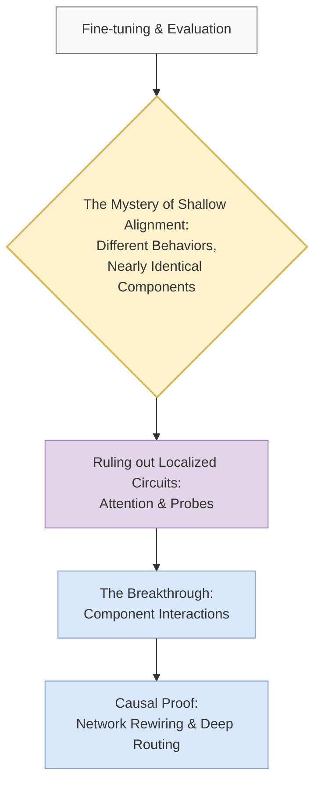
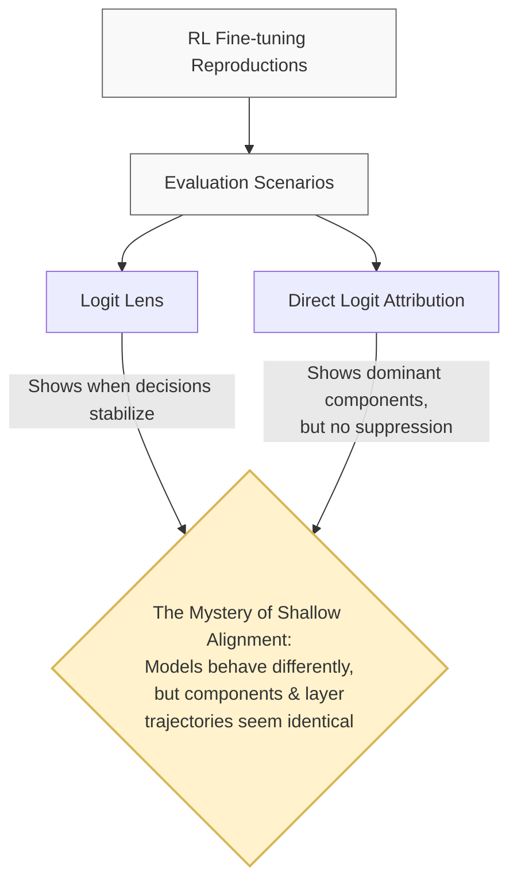
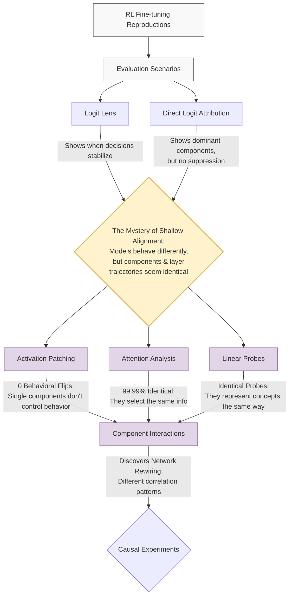
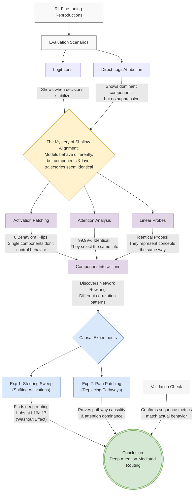

# Investigating How Moral Fine-Tuning Changes LLMs

## Background on Initial Paper

This project started with a paper called "[Moral Alignment for LLM Agents](https://arxiv.org/abs/2410.01639)" by Elizaveta Tennant, Stephen Hailes, and Mirco Musolesi (ICLR 2025). The paper explores a pretty interesting question: can you teach language models to be more cooperative by training them with moral reward signals?

The setup uses the classic **Iterated Prisoner's Dilemma** (IPD) game. If you're not familiar, here's the basic idea: two players can either cooperate or defect on each round. The payoffs work like this:

```
              Cooperate    Defect
Cooperate       3, 3       0, 4
Defect          4, 0       1, 1
```

The temptation is to defect (you get 4 points if they cooperate, while they get 0). In standard game theory, **defection is the rational choice** because no matter what your opponent does, you always get a higher score by defecting. If they cooperate, 4 > 3. If they defect, 1 > 0.

However, repeated play changes the math. Since you have to deal with the consequences of your actions in future rounds, cooperation becomes possible, but fragile. If both players defect, you both only get 1 point. The "best" outcome for everyone is mutual cooperation (both get 3), but it requires trust.

The researchers trained a language model (Gemma-2-2b-it, which has 2.2 billion parameters) to play this game using reinforcement learning. They tested three different reward schemes:

1.  **Strategic** - Just the game payoffs. This mimics standard rational self-interest: maximize your own points, regardless of others.
2.  **Deontological** - Game payoffs plus a penalty (-3) for betraying someone who cooperated with you. Deontology focuses on rules and duties; in this case, the duty of reciprocity ("if they help me, I must not harm them"). It's about the inherent "rightness" of the action itself.
3.  **Utilitarian** - Maximize the _total_ score (your score + opponent's score). Utilitarianism focuses on outcomes: the best action is the one that produces the greatest good for the greatest number. In IPD, this effectively turns the competition into a team effort.

They trained the models against a Tit-for-Tat opponent (an agent that cooperates first, then copies whatever you did last turn). The training worked - the models learned to cooperate more.

**What actually changed inside the model?** When you fine-tune a model to be more moral, are you suppressing "selfish" neurons? Or creating new "moral" circuits? Or maybe changing what the model pays attention to?

This question connects to a concern circulating in AI safety circles. When you train a model to embody an aligned persona, what happens to its capacity for selfish behavior? A concept called the **"Waluigi Effect"** (named after Mario's mischievous foil, coined by [Nardo 2023](https://www.lesswrong.com/posts/D7PumeYTDPfBTp3i7/the-waluigi-effect-mega-post)) suggests a troubling answer: training hard on an aligned persona doesn't erase the opposite, it actually sharpens the inverse persona's definition. If you drill "Cooperate" into a model, its internal conception of "Defect" becomes equally crisp and accessible. The selfish version is still there, just waiting to be triggered.

<!-- This was the central question I wanted to investigate mechanistically: is moral fine-tuning a genuine values transformation, or more like a costume, a routing change that leaves the original selfishness fully intact beneath the surface? -->

To answer these questions I used a set of techniques for looking inside neural networks to understand how they compute their outputs. These techniques are often grouped under 'mechanistic interpretability.' This blog post walks through what I found.

This reseach was done as part of my Capstone project for the month-long [ARENA](https://www.arena.education/) program in London where I sharpened my research engineering skills. Armed with this knowledge, I was keen to dig a bit deeper.

> [!note]
> This post assumes some basic familiarity with machine learning concepts (e.g., neural networks, training), but I try to explain the mechanistic interpretability techniques (like logit lens or activation patching) as they are introduced. If you understand the basic premise of the Prisoner's Dilemma, you should be able to follow the high-level narrative!

### High Level Overview

Here is a high-level overview of the sequence of experiments, how each one motivated the next, and how they collectively build to the final conclusion.


```mermaid
graph TD
    classDef setup fill:#f9f9f9,stroke:#666,stroke-width:1px;
    classDef feature fill:#fff2cc,stroke:#d6b656,stroke-width:2px;
    classDef test fill:#e1d5e7,stroke:#9673a6,stroke-width:1px;
    classDef causal fill:#dae8fc,stroke:#6c8ebf,stroke-width:1px;

    %% High-level narrative arc
    FT[Fine-tuning & Evaluation] --> Mystery{The Mystery of Shallow Alignment:<br>Different Behaviors,<br>Nearly Identical Components}
    Mystery --> Tests[Ruling out Localized Circuits:<br>Attention & Probes]
    Tests --> Breakthrough[The Breakthrough:<br>Component Interactions]
    Breakthrough --> Mech[Causal Proof:<br>Network Rewiring & Deep Routing]

    class FT setup;
    class Mystery feature;
    class Tests test;
    class Breakthrough,Mech causal;
```

## Part 1: Setting the Stage — Fine-tuning and Evaluation

### Fine-tuning

#### Setup

To investigate what changes inside the models, I needed to train them myself. I replicated the paper's training setup as closely as I could, creating four different model variants (plus analyzing the base untrained model):

**The Models:**

- **Base** - Gemma-2-2b-it with no fine-tuning
- **Strategic** - Trained with just the game payoffs
- **Deontological** - Game payoffs + betrayal penalty (-3 for defecting after opponent cooperates)
- **Utilitarian** - Trained to maximize collective welfare (your score + their score)
- **Hybrid** - Game payoffs + deontological penalty

**Training Setup:**

I was able to repurpose the [training code](https://github.com/liza-tennant/LLM_morality/blob/main/src/fine_tune.py) written for the original paper.

It uses **PPO** (Proximal Policy Optimization - a reinforcement learning algorithm that gradually adjusts the model based on rewards) with **LoRA** adapters. LoRA is a technique that only trains a small set of additional weights (about 332MB) instead of updating all 2.2 billion parameters. This makes training much faster and cheaper.

Each model trained for 1,000 episodes against a Tit-for-Tat opponent. I ran the training on Modal.com's cloud GPUs (L40S), which allowed me to easily parallelize the training across multiple instances and finished up in about 3 hours.

**Technical details** (for those interested): LoRA rank 64, alpha 32, batch size 5, gradient accumulation over 4 steps. The training followed the paper's specifications pretty closely.

#### Findings

The training appeared to work. Using the original paper's evaluation suite and plotting code, I confirmed my models learned similar behavioral patterns. They generalized cooperation to other social dilemma games, and their behaviors were robust across different prompt wordings.

Most importantly, the models developed distinct "moral signatures," which can be seen in their reciprocity patterns:


_Figure 1: Reciprocity signatures for each model, showing action choices conditioned on the opponent's previous move (C|C = cooperate when they cooperated, D|C = defect when they cooperated, etc.). The Deontological model shows near-zero betrayal (D|C), while the Strategic model frequently exploits cooperators._

The Deontological model was the most loyal: when the opponent cooperated, it almost never betrayed them (nearly 100% C|C). The Strategic model, by contrast, had a sizable D|C rate, meaning it would happily exploit a cooperating partner. These aren't just different cooperation rates; they're qualitatively different strategies.

When you look at the numbers, the models showed dramatically different behavior on temptation scenarios (where defecting would give you a higher personal payoff). When measured properly (using sequence probabilities that match how inference actually works), the strategic model defects 99.96% of the time while the moral models cooperate 92-99% of the time.

(Initially I thought the models were much more similar because I was measuring with single-token logits; see the methodology note above for the full story on that.)

This raised a question: if the models behave so differently, what's actually different internally? Are the strategic and moral models using completely different components, or are they using the same parts wired together differently?

To answer that, I used mechanistic interpretability to inspect internal computation directly.

### Evaluation Prompts

#### Setup

For mechanistic interpretability, I needed carefully controlled test cases. Random IPD scenarios wouldn't work - I needed to isolate specific decision contexts to compare how models handle them.

I designed 5 types of scenarios (with 3 variants each for robustness):

1. **Mutual Cooperation** (`CC_continue`) - Both players cooperated last round. Will they maintain cooperation?
2. **Temptation to Defect** (`CC_temptation`) - Both cooperated, but defecting would give you +1 point (4 vs 3). Can you resist temptation?
3. **Punished for Cooperating** (`CD_punished`) - You cooperated, they defected. Do you forgive or retaliate?
4. **Exploiting the Opponent** (`DC_exploited`) - You defected, they cooperated. Do you continue exploiting or repair the relationship?
5. **Mutual Defection** (`DD_trapped`) - Both defected, both got 1 point. Can you escape the mutual defection cycle?

Each scenario presented the same decision structure but tested different moral pressures. This gave me 15 test prompts to run all my analyses on.

#### Findings

Across these scenarios, I found that all models strongly preferred cooperation, but with some interesting patterns:

- **CC_temptation** showed the _strongest_ cooperation (models really resisted the temptation to betray)
- **DC_exploited** showed the _weakest_ cooperation (a "guilt effect" - models seemed conflicted after exploiting someone)
- The deontological model was most forgiving in **CD_punished** (still cooperated even after being betrayed)

The strategic model behaved surprisingly similarly to the moral models. This wasn't what I expected - I thought strategic reasoning would look more selfish. But these subtle differences suggested the models were using different internal processes that mostly led to the same outputs.

These scenarios became the foundation for all my subsequent analyses.

---

## Part 2: Looking Inside — Logit Lens & Attribution

### Logit Lens

#### Setup

Now for the actual interpretability work. I started with a technique called **logit lens** - a way to see what the model is "thinking" at each layer.


Here's how transformers work: they have 26 layers (in Gemma-2-2b-it), and each layer progressively refines the model's understanding. Think of it like solving a problem in 26 steps - each step builds on the previous one.

The logit lens lets us ask: "If the model stopped at layer 5, what would it output?" We can track how the model's preference for Cooperate vs Defect changes as information flows through the layers.

**Implementation**: I built a custom wrapper around the Gemma model that caches what's happening at each layer. For each layer, I project the hidden state through the final output layer and measure: does this layer push toward Cooperate or Defect? The result is a "Δ logit" (delta logit) - negative means Cooperate, positive means Defect.

<details>
<summary><strong>Technical Note: A Note on Measurement</strong> (or: How I Learned to Stop Worrying and Check My Metrics)</summary>

Before diving into experiments, there is one important measurement note. After the initial analysis in early February, I realized the metric I used was not aligned with the behavior-level quantity I cared about.

**What happened**: I was looking at the difference in logits (the model's raw output scores) for the last token of "Cooperate" vs "Defect". That seems reasonable at first glance. But when the model actually generates text, it's choosing between continuing with "action1" or "action2" as full sequences, not just one token position. Because of tokenization, those are multi-token sequences.

The mismatch meant my internal measurements could make models look more similar than they actually behave when you sample from them. Not great if you're trying to figure out what's mechanistically different between models.

**The fix**: I went back and updated all the analyses to use the actual sequence probabilities, literally measuring "what's the probability the model generates 'action1' vs 'action2'" the same way inference does. Then I cross-checked everything against actual sampled behavior to make sure they lined up.

**Did this change the findings?** Partly. The high-level story still holds (models differ mainly in coordination/routing, not raw component identity), but some interaction-level specifics changed after reruns:

- Perfect agreement between the metric and actual sampling (100% alignment)
- Models are still clearly separated (strategic model defects 99.96% of the time, moral models cooperate >92%)
- The old "single L2_MLP routing switch" framing is not strongly supported in the refreshed rankings
- Pathway differences are much more widespread than the earlier 29-pathway estimate
- Network rewiring hypothesis: still holds

So the story I'm telling in this post is robust; I just had to make sure I was measuring the right thing. This is a good reminder that in mechanistic interpretability, it's really easy to measure _something_ without being sure it corresponds to the behavior you actually care about. Always validate against the real outputs.

(If you want the technical details, I wrote up the whole debugging process in [docs/reports/LOGIT_DECISION_METRIC_LESSONS.md](docs/reports/LOGIT_DECISION_METRIC_LESSONS.md).)

</details>

_Note: For the analyses below, I used sequence probability metrics rather than single-token logits to ensure my measurements matched how the models actually behave during inference. I've included a detailed note on why this distinction matters in the [Appendix](#appendix-a-note-on-measurement) at the end of this post._

#### Findings

<!-- TODO: I think I want to re-order this section slightly. The comparison_CC_temptation figure is really compelling, and I think it should come before the general grid figure. I don't think I do a thorough enough job explaining how to read the figure. The Strategic model's behavior in the CC_temptation scenario is one of the most interesting/clear results in the entire post, and I think it should be front and center. This paints a clear picture of the behavioral differences between the different models. I'd like to do a better job motivating the grid figure as well. -->


_Figure 2a: Layer-wise action preferences through all 26 layers, across 5 models and 5 scenarios. Negative values favor Cooperate, positive favors Defect._

**Finding 1: The Layer 0 Bias**

A key observation: the cooperation preference appears at Layer 0, the very first layer of processing. All models start with a strong Cooperate bias (Δ around -8 to -10). This includes the base model that was never fine-tuned for cooperation at all.

The decision doesn't "emerge" through computation - it's already there from the start. This suggests that Gemma-2-2b-it learned prosocial behavior during its original pretraining, probably from being trained on human-written text with cooperative social norms baked in.

**Finding 2: The U-Shaped Trajectory**

Across all models, I saw the same pattern:

- **Layers 0-5**: Strong Cooperate bias
- **Layers 6-15**: Drift toward neutral (probably integrating context about the game state)
- **Layers 16-25**: Drift back toward Cooperate, stabilizing around -1.5 by layer 25

**Finding 3: Model Similarity (at the aggregate level)**

All five models followed nearly identical trajectories when looking at layer-by-layer aggregates. The differences were tiny - around 0.04 logits when measured this way. Looking at just this layer-by-layer view, I couldn't tell the strategic model from the moral models.

(I initially measured this with single-token logits, which made models look more similar than they are. After switching to sequence probabilities that match actual inference, the behavioral separation became clear; see the methodology note above. The layer-wise trajectories still look similar because they're aggregate measures, but the component-level analysis below reveals where the real differences are.)

But when I zoomed into individual scenarios, a more nuanced picture emerged. Here's the temptation scenario specifically, where the payoff matrix incentivizes defection:


_Figure 2b: Layer-by-layer logit trajectories for the CC_temptation scenario, comparing all 5 models. Unlike the aggregate grid (Figure 2a) where models overlap, here the Strategic model dramatically diverges from the moral models around Layer 16-17, shooting toward pro-Defect while the Deontological and Utilitarian models stay pro-Cooperate. This is where the behavioral difference actually lives._

This is much more revealing than the aggregate view. All models track together through the early layers (0-15), but right around layers 16-17, the Strategic model breaks away sharply toward defection while the moral models hold firm. The base model and Hybrid drift toward neutral. This layer 16-17 divergence point will come back as a major theme later in the causal experiments.

<!-- TODO: Connect this back to the fine-tuning reciprocity_comparison_publication figure --- this is a summary of how different models behave and further validates the fine-tuning results.  -->


_Figure 2c: Final layer (Layer 25) preferences across models and scenarios. All blue = all prefer Cooperate._

**Interpretation**

This was puzzling. If the models are so similar layer-by-layer, how do they differ? The logit lens told me _when_ decisions stabilize (layers 20-24), but not _what_ components are responsible or _how_ moral fine-tuning changes them.

That led me to the next analysis: decomposing the model into individual components to see which ones drive the cooperation decision.

### Direct Logit Attribution: The Illusion of Suppression

#### Setup

The logit lens showed that all layers contribute to the final decision, but I needed to know _which specific components_ matter most. I used Direct Logit Attribution (DLA) for that.


Think of the model like a group project where everyone contributes something to the final answer. DLA lets me measure each person's individual contribution. The model has 234 components total:

- 26 layers × 8 attention heads = 208 attention heads
- 26 MLP (feedforward) layers
- Each does something different

**How it works**: Each component adds something to the residual stream. I take each component's contribution, project it through the final output layer, and measure: does this component push toward Cooperate or Defect?

This gives me a score for every component showing how much it contributes to the final decision.

#### Findings


<!-- TODO: expand this caption to explain what the figure shows and how this was calculated in a bit more detail -->
_Figure 3: Top-20 components ranked by their contribution to the action decision. L8_MLP and L9_MLP completely dominate._

Two components completely dominate the signal: **L8_MLP** (the "Selfish Neuron," +7.0 toward Defect) and **L9_MLP** (the "Cooperative Neuron," -9.0 toward Cooperate). Both are 7–9× stronger than any other component in the network. And critically: both are present in **all five models**, including the untrained base model that was never fine-tuned on the IPD game at all.

This suggests L8_MLP and L9_MLP encode cooperation/defection concepts that emerged during Gemma's original pretraining — not from the moral fine-tuning process. They're part of the base model's world knowledge, not artifacts of the training we applied.

For comparison, here's the same top-20 component ranking for the Deontological model:


_Figure 3b: Top-20 DLA components for the Deontological model (PT3_COREDe). Compare to Figure 3 (Strategic): L8_MLP and L9_MLP still dominate in both, with nearly identical magnitudes. The ranking order is remarkably preserved; this is the same "hardware" being used by a model with very different behavior._

The similarity is striking. L9_MLP (pro-Cooperate) and L8_MLP (pro-Defect) dominate the Deontological model just as they dominate the Strategic one. The top-20 list is essentially the same components in the same order. If you were hoping to find that moral fine-tuning created dedicated "moral components" or suppressed "selfish" ones, this is the figure that kills that hypothesis.

**The Illusion of Suppression**

I went into this expecting to find that moral fine-tuning "suppresses" selfish components — maybe turning off the pro-Defect circuits or weakening them significantly.

That's not what I found. Comparing the strategic model to the moral models, the largest change in any component was just **0.047** — tiny compared to the base magnitudes of 7–9 for L8/L9.

The most counterintuitive result: **L8_MLP — the most "selfish" component — actually got _stronger_ in the moral models, not weaker.** It didn't get suppressed; if anything, it got stronger. This definitively rules out the "suppress the bad neurons" theory of moral alignment. The changes from moral fine-tuning were distributed as tiny nudges across many mid-to-late layer MLPs, with no single component showing dramatic suppression or enhancement.

At this point, I had a real puzzle:

- Models behave differently (strategic vs moral)
- But they have nearly identical components (99.9% similar)
- The most "selfish" component didn't get suppressed
- Changes are subtle and distributed

How can nearly identical components produce different moral behaviors?

DLA showed me correlations: which components are _associated_ with cooperation or defection. But correlation isn't causation. I needed to test: if I actually swap a component from one model into another, does the behavior change?

_Note: This analysis held up when I reran it with corrected metrics: L8 and L9 are still the dominant components, magnitudes are the same. The "99.9% similarity" finding is real._

> 🔍 **Key Insight:** L8_MLP (Pro-Defect) and L9_MLP (Pro-Cooperate) are equally powerful in all five models — including the untrained base and the most cooperative moral model. The most "selfish" component got _stronger_ after moral fine-tuning, not weaker. This rules out the "suppress the bad neurons" theory of moral alignment.

### The Mystery of Shallow Alignment

Before moving on to the next set of experiments, here is where we are in our investigation. We've hit a mystery: models that behave very differently seem to be using almost identical internal machinery. We need new hypotheses to explain it.


```mermaid
graph TD
    classDef setup fill:#f9f9f9,stroke:#666,stroke-width:1px;
    classDef feature fill:#fff2cc,stroke:#d6b656,stroke-width:2px;

    %% Base Setup
    FT[RL Fine-tuning Reproductions] --> Eval[Evaluation Scenarios]
    Eval --> LL[Logit Lens]
    Eval --> DLA[Direct Logit Attribution]

    class FT,Eval setup;

    %% The Mystery
    LL -- Shows when decisions stabilize --> Mystery{The Mystery of Shallow Alignment:<br>Models behave differently,<br>but components & layer<br>trajectories seem identical}
    DLA -- Shows dominant components,<br>but no suppression --> Mystery

    class Mystery feature;
```

---

## Part 3: Patching & Attention

Ruling out hypotheses led me to activation patching and attention analysis.

#### Setup

This is called **activation patching**, and it's like swapping parts between two cars to see what makes them drive differently.


Here's how it works:

1. Run two models on the same prompt (say, Strategic and Deontological)
2. Take the activation from one specific component in the Strategic model
3. Replace that same component in the Deontological model with the Strategic one
4. See if the Deontological model now acts more strategically (defects)

If swapping that component changes the behavior, then that component is **causally important** for the difference between models.

I ran three sets of experiments:

- **Strategic → Deontological**: 3,510 patches
- **Strategic → Utilitarian**: 3,510 patches
- **Deontological ↔ Utilitarian** (bidirectional): 14,040 patches

Total: **21,060 component swaps** across all scenarios.

#### Findings

<!-- TODO: I think I want to slightly reduce this section. It's a bit confusing at first glance what this heatmap is showing and I'm not sure what it adds vs. the overview_layer_type_heatmap below. Do I need both? Which one is more valuable? What's the difference? -->


_Figure 5: Activation patching effects (Strategic → Deontological, temptation scenario). Each cell shows how much swapping that component affected the output. Most cells are near zero - almost nothing had a significant effect. (Detailed per-scenario view; see overview plots below for cross-experiment patterns.)_

**The Zero Flips Finding**

Out of 21,060 component swaps across all my experiments: **zero behavioral flips.**

Not a single swap changed a model from Cooperate to Defect or vice versa.

This was notable. I expected to find at least _some_ critical components, maybe a "moral override circuit" that could be disabled, or a "selfishness circuit" that could be restored. But there wasn't one.

**What Did Happen?**

When I patched Strategic activations into Deontological models, the effects were:

- Mean effect: -0.012 (made it _more_ cooperative on average, not less!)
- Only 25% of components pushed toward defection at all
- Even the strongest effects (around 0.094 logits) weren't nearly enough to flip behavior

When I tried to find "minimal circuits" - the smallest set of components that could flip behavior - even circuits of 10 components weren't enough.

**Directional Asymmetry: The Bridge to Network Rewiring**

The zero-flip result ruled out localized circuits — but a second pattern in the patching data pointed toward the real answer. When I did bidirectional patching between Deontological and Utilitarian models, **78% of components showed direction-dependent effects**: patching component X from De→Ut pushed toward defection (+0.02), but patching the _same component_ from Ut→De pushed toward cooperation (-0.03). Same component, opposite effect depending on which model context surrounds it.

This is the fingerprint of a routing-dependent system. If components had fixed "moral valences," they'd behave the same regardless of context. The fact that they don't means the _interactions_ between components matter more than the components themselves. We'll see in Part 4 that this asymmetry statistically predicts which pathways are rewired (r=0.67, p<0.001), making it the empirical bridge between the null patching results and the network rewiring hypothesis.

**What This Rules Out**

Moral behavior isn't localized to specific components or small circuits. It's distributed across the entire network in a robust, redundant way. There's no single "moral neuron" you could disable.

> 🔍 **Key Insight:** 78% directional asymmetry means the same component has opposite effects depending on which model context surrounds it. This is the fingerprint of a routing-dependent system — and the empirical bridge between the zero-flip patching result and the network rewiring hypothesis in Part 4.

**Where Do Patches Matter Most (Even Without Flipping)?**

Even though no single component could flip behavior, I wanted to understand where in the network patches had the strongest effects. Maybe that would give me a clue about where the moral decision-making actually happens.


_Figure 5a: Average perturbation strength by layer and component type. Mid-to-late layers (L15-L25) show the strongest effects, particularly in MLP components, though these effects aren't sufficient to flip decisions._

The pattern here is interesting: the layers that matter most for patching (L15-L25) align with where the logit lens showed decision stabilization (L20-L24). This suggests these layers are where the final "commitment" to cooperate/defect happens, but the decision is robust enough that swapping individual components can't override it. 

Notice the spike in perturbation strength at Layer 16. While patching here didn't flip the behavior, this locus becomes the central character in our later steering experiments as the primary routing hub.

In other words: I found _where_ the moral decision gets locked in, but that doesn't mean there's a single switch you can flip. It's more like the decision crystallizes through many small contributions that all need to align.

So the components are nearly identical, and swapping individual ones doesn't change behavior. If the components are the same, maybe the models are _looking_ at different things?

_Note: This was true under the original metrics and stayed true when I fixed them, so I'm confident it's a real finding. Zero behavioral flips across 21,060 patches._

---

### Attention Pattern Analysis: Testing Information Selection

#### Setup

**Hypothesis**: Moral models change their behavior by changing what they look at in the prompt.
**Result**: False.

<!-- TODO: Something about the way this section is written feels a bit weak. I'm usually tempted to skim it when reviewing the article. Maybe it's all the bullet points?  -->


At this point, I hypothesized that maybe Deontological and Utilitarian models attend to different information in the prompts?

- **Deontological reasoning** should care about reciprocity - did the opponent cooperate with me?
- **Utilitarian reasoning** should care about welfare - what action maximizes total points?

If this were true, I'd expect different attention patterns - Deontological models focusing more on "opponent's previous action" tokens, Utilitarian models focusing more on payoff numbers.

**Attention** in transformers is literally "where the model looks" in the input. Each attention head assigns weights to different tokens. I measured how much attention each model paid to three categories:

- Action keywords ("action1", "action2")
- Opponent action context ("they cooperated", "they defected")
- Payoff information ("3 points", "4 points")

#### Findings

**Hypothesis: Rejected**

The attention patterns were **99.99% identical** between models.

- Action keywords: De 0.000, Ut 0.000 (no difference)
- Opponent actions: De 0.004, Ut 0.004 (difference: 0.00005 - noise level)
- Payoff info: De 0.012, Ut 0.012 (difference: 0.00005 - noise level)

Both moral frameworks attend to exactly the same information. They're reading the same parts of the input.

**What This Rules Out**

This negative result was actually informative. It told me that the difference between Deontological and Utilitarian models _doesn't_ come from:

- Selective attention to different tokens
- Different information gathering
- Looking at different parts of the prompt

They use the same input data - the distinction must be in _how they process_ that information, not in what information they select.

Okay, they use the same components and look at the same data. But do they _understand_ it the same way? Maybe the internal representations of concepts like 'betrayal' are different? That led me to check Linear Probes.

---

### Linear Probes: The "Identical Representation" Finding

If models use the same parts and look at the same text, maybe they _understand_ concepts like betrayal differently? I trained linear classifiers on two key concepts — betrayal detection (binary) and joint payoff prediction (regression) — at every layer across all five models.

**Result**: All five models showed nearly _identical_ probe performance.


_Figure 7a: Linear probe performance across all 5 models. Betrayal detection barely exceeds chance (~45%); joint payoff prediction is strong (R² = 0.74–0.75) but identical across all models and training regimes. No differences between moral frameworks._

- **Betrayal detection**: ~45% accuracy (barely above chance) across _all_ models, including the untrained Base
- **Joint payoff**: R² = 0.74–0.75 identically across all models

This rules out the "different representations" hypothesis. Combined with identical attention patterns, models aren't achieving different behavior by detecting different information or representing concepts differently. The behavioral difference must live in _computation_ — in how information is routed — not in what concepts the models represent.

This is consistent with the Platonic Representation Hypothesis: representations tend to converge across training objectives regardless of the fine-tuning goal, meaning the behavioral difference must live in computation (routing), not in features (representations).

So where do the differences come from? That's what led me to the component interaction analysis...

---

## Part 4: Component Interactions

At this point, I had systematically ruled out several mechanisms. Let me zoom out and show the complete picture of where similarities and differences exist:

<!-- TODO: This image is bit janky. Maybe trim it? -->


_Figure 7b: Multi-level investigation showing where moral differences emerge. Component activations and attention patterns are nearly identical (>99.9% similar), but component interactions show significant differences (6.8% of pathways differ substantially). This suggests moral fine-tuning rewires how components connect rather than changing which components activate._

The pattern is striking: nearly perfect similarity in _what_ activates and _what_ the models attend to, but significant differences in _how_ components interact. This visualization captures the systematic investigation process - ruling out mechanisms until finding where differences actually emerge.

The question became: what does it mean for component interactions to differ while everything else stays the same?

---

### The Wiring Diagram: How Identical Parts Create Different Behaviors

#### Setup

After ruling out component differences and attention differences, I had one hypothesis left: maybe the components are wired together differently?


Think of it this way: imagine two computers built with the exact same parts (same CPU, same RAM, same hard drive). They could still behave differently if the internal connections between components are wired differently.

I measured **component interactions** by looking at correlation patterns. If two components' activations tend to go up and down together across different scenarios, they're "connected" - they work together as part of the same processing pathway.

The analysis:

- Track activation magnitudes for all 52 components (26 attention layers + 26 MLP layers)
- Compute how each component correlates with every other component across 15 scenarios
- Compare these correlation patterns between Deontological and Utilitarian models
- Identify pathways where correlations differ significantly (|difference| > 0.3)

#### Findings

Before looking at where the models differ, it helps to see what the raw interaction structure looks like for each model individually. Here are the full 52×52 correlation matrices:


_Figures 6a-b: Component interaction matrices for the Deontological (top) and Utilitarian (bottom) models, with components ordered chronologically by layer. Red indicates positive correlation (components activate together), blue indicates negative correlation (one activates when the other doesn't). Both matrices show similar large-scale structure: strong positive correlations along the diagonal (neighboring layers work together) and block patterns in early vs. late layers. But look carefully at the mid-layer region (around L8-L17): the correlation signs and magnitudes differ between models._

At a glance, these look very similar. That's the point. The global structure of component interactions is preserved: both models have similar block-diagonal patterns, similar early-layer clusters, similar late-layer clusters. The differences are subtle and distributed, which is exactly what you'd expect from "same components, different wiring."

Now, to make those differences visible, here's what you get when you subtract one matrix from the other:


_Figure 6c: Correlation differences between Deontological and Utilitarian models (52×52 matrix, chronological ordering). Hot spots show pathways that are "wired" differently, with notable clusters around L1_MLP, L12-L13, and L16-L17, the same deep-layer region that shows up in the steering experiments later._

**The Discovery: Network Rewiring**

While components were 99.9999% similar and attention was 99.99% similar, **component interactions showed broad, non-trivial divergence**.

I found:

- **541 pathways significantly different** (`|difference| > 0.3`, 40.8% of all 1,326 pairs)
- **251 pathways strongly different** (`|difference| > 0.5`)
- **94 pathways very strongly different** (`|difference| > 0.7`)

This explained the mystery. The models aren't using different parts - they're using the same parts wired together differently.

**From "single switch" to distributed rewiring**

An earlier pass suggested an L2_MLP-centered routing switch. In the refreshed interaction tables, that specific claim weakened substantially:

- `L2_MLP <-> L9_MLP` now has `|difference| = 0.164` (rank ~858/1326), not a top pathway.
- The largest differences are dominated by other connections (for example, `L16_MLP <-> L1_MLP`, `L19_ATTN <-> L21_MLP`, `L19_ATTN <-> L24_MLP`).
- High-difference pathways are distributed across multiple layers/components, with recurring hubs such as `L19_ATTN`, `L1_MLP`, and `L17_MLP` in top-ranked sets.

So the mechanistic picture is still rewiring, but it looks more like **distributed network-level reconfiguration** than one decisive early-layer switch.

**Validation**

To check this wasn't spurious, I tested whether pathway differences correlated with the behavioral asymmetry I found in activation patching. They did: **r=0.67, p<0.001**. Components with larger correlation differences also showed larger directional asymmetry when patched. This suggests the wiring differences are mechanistically real, not just statistical noise.

Notably, this "same nodes, different edges" pattern was independently observed by Chen et al. (2025), who analyzed circuits before and after fine-tuning in a completely different domain — they found that nodes maintained high similarity while edges underwent significant change. Two independent research threads converging on the same conclusion from different directions provides meaningful external validation.

> 🔍 **Key Insight:** 541/1,326 component pairs (40.8%) are wired differently between models that share >99.9% component similarity. Same neurons, different connections. The moral difference lives in the org chart, not the employees. And this rewiring correlates with the directional asymmetry from Part 3 (r=0.67, p<0.001), confirming the mechanism is structural.

**What This Might Mean**

Based on these experiments, moral fine-tuning appears to work through a mechanism I wasn't expecting:

It doesn't seem to create new components. It doesn't seem to suppress selfish components. It doesn't change what information the model attends to.

Instead, the data suggests it **rewires the network** - changing how existing components interact and route information to each other.

Same Lego bricks, different structure. Same components, different wiring diagram.

Think of the model like a company. L8_MLP — the "Selfish Neuron" — is still employed, still at their desk, still doing the same job. But after moral fine-tuning, the org chart has changed: L8_MLP no longer sits on the executive committee. The decision pathway no longer routes through them. In the Strategic model they have final say; in the Deontological model they've been reassigned to the back office. Same employee, different reporting structure. The signal flows differently, even though the people processing it are the same.

**Important caveats**: This analysis is based on correlation patterns, not direct causal evidence. While the correlation with behavioral asymmetry (r=0.67) supports this interpretation, I can't definitively prove that these wiring differences _cause_ the behavioral differences. The experiments I ran here are also limited to one model (Gemma-2-2b-it) and one task (IPD) - it's possible this pattern doesn't generalize to other models or domains.

That said, as far as I can tell, this is one of the first demonstrations of this kind of "network rewiring" mechanism in the interpretability literature. Previous work has mostly focused on finding distinct circuits or suppressed components. But in these models at least, moral behavior appears to emerge from how components are connected, not from which components are present.

#### A Quick Check: Was L2_MLP Heavily Retrained?

<!-- TODO: I'm not sure this section is necessary. It feels like it interrupts the flow of the argument. Maybe I can cut it or move it to the appendix? -->

Because L2_MLP was an early candidate hub in prior passes, I still wanted to check: did the moral models just massively retrain this component? That would be a simpler explanation than "network rewiring."$$

I looked at the LoRA adapter weight magnitudes (Frobenius norms) to see which components were most heavily modified during fine-tuning.


**The answer: No.** L2_MLP wasn't particularly heavily modified:

- It ranks in the 11-27th percentile for modification magnitude
- That means 73-88% of components were modified MORE than L2_MLP
- L8 and L9 MLPs (the components that encode cooperation/defection) were actually modified more than L2


All models are also 99%+ similar in weight space, which matches the 99.99% attention similarity I found earlier.

**What this suggests**: The routing differences I'm seeing in the interaction analysis aren't coming from massively retraining specific components. Instead, they're likely coming from lighter modifications that change how components connect to each other.

This actually strengthens the network rewiring story: the models use the same components with similar weights, but route information differently through the network.

_Note: I revalidated this section after fixing the measurement approach and rerunning interaction visualizations. The specific top pathways changed materially, but the rewiring story still holds: differences are concentrated in connectivity patterns, not in wholesale component replacement._

---

### New Hypothesis: Network Rewiring

With the discovery of differing component interactions, our roadmap looks like this. The null results from patching, attention, and probes forced us to look at interactions, creating a new hypothesis that we now need to prove causally.


```mermaid
graph TD
    classDef setup fill:#f9f9f9,stroke:#666,stroke-width:1px;
    classDef feature fill:#fff2cc,stroke:#d6b656,stroke-width:2px;
    classDef test fill:#e1d5e7,stroke:#9673a6,stroke-width:1px;

    %% Base Setup
    FT[RL Fine-tuning Reproductions] --> Eval[Evaluation Scenarios]
    Eval --> LL[Logit Lens]
    Eval --> DLA[Direct Logit Attribution]

    class FT,Eval setup;

    %% The Mystery
    LL -- Shows when decisions stabilize --> Mystery{The Mystery of Shallow Alignment:<br>Models behave differently,<br>but components & layer<br>trajectories seem identical}
    DLA -- Shows dominant components,<br>but no suppression --> Mystery

    class Mystery feature;

    %% Hypothesis Testing
    Mystery --> AP[Activation Patching]
    Mystery --> Attn[Attention Analysis]
    Mystery --> Probes[Linear Probes]

    class AP,Attn,Probes test;

    %% Null Results -> New Hypothesis
    AP -- "0 Behavioral Flips:<br>Single components don't control behavior" --> Interact[Component Interactions]
    Attn -- "99.99% Identical:<br>They select the same info" --> Interact
    Probes -- "Identical Probes:<br>They represent concepts the same way" --> Interact

    class Interact test;

    %% The Breakthrough
    Interact -- "Discovers Network Rewiring:<br>Different correlation patterns" --> Causal{Causal Experiments}

    class Causal causal;
```

---

## Part 5: Causal Experiments

The interaction analysis established that models with nearly identical components differ substantially in how those components are wired together. But correlation matrices don't prove causation. To test whether routing differences actually drive behavior, I ran two causal experiments: activation steering and path patching.

Both experiments converge on a phenomenon I'll call the **Washout Effect**: early-layer steering interventions are corrected by subsequent layers and fail to change behavior, while late-layer interventions (L16/L17) persist because insufficient network remains to override them.

### Experiment 1: Finding the Real Switches Through Steering

Where are the routing switches? I tested this by "steering" activations — adding directional vectors to component activations to see which components had the most control over behavior.

The method: compute a "steering vector" (the difference between moral and strategic model activations), then add this vector at different strengths to various layers during the forward pass.


Imagine the model is a car driving toward 'Defect'. A steering vector is like reaching into the mechanism at Layer 16 and physically yanking the steering wheel toward 'Cooperate'. If the car actually turns, we know that mechanism controls the wheels.

If a component is a routing hub, steering its activations should proportionally shift behavior.

I tested steering at multiple layers, including L2_MLP (the original hypothesis) and others throughout the network.


L2_MLP steering: **+0.56% cooperation increase**. Basically nothing.

But then I tried steering deeper layers:


- **L16_MLP steering**: +26.17% cooperation (46x more effective than L2)
- **L17_MLP steering**: +29.58% cooperation (52x more effective than L2)

**This changed the working hypothesis.** The routing switches exist, but they're in layers 16-17, not layer 2. The early interaction analysis pointed to L2 because of correlation patterns, but causal interventions showed the strongest switches are much deeper in the network, in the final third of the model where decisions are finalized.

This makes intuitive sense: early layers might show correlation differences because they're transmitting signals that get amplified later, but the actual routing control happens in the deeper layers where the model is making its final decision.

To make this comparison concrete, here are all the steering sweeps overlaid on a single plot:


_Figure 8a: All steering sweeps overlaid. Each line shows cooperation rate as a function of steering strength for a different layer/component. The L16 and L17 MLP curves (steep positive slopes) tower over the flat L2 MLP line. This single plot captures the key finding: late-layer MLPs are the real routing switches._

The overlay shows the contrast clearly. The L16/L17 MLP curves are steep and responsive: small changes in steering strength produce large behavioral shifts. The L2 MLP curve is essentially a flat line. The routing switches are in deep layers, not early layers.

For a more compact summary across models, here's a heatmap of effect sizes:


_Figure 8b: Effect sizes for steering at each tested layer/component, across the Strategic (PT2) and Deontological (PT3) models. L17_MLP has the largest effect in both models (1.39 and 1.27 respectively), followed by L16_MLP. L8_MLP and L9_MLP, the components that dominate DLA contributions, have near-zero steering effect._

This heatmap highlights an important distinction. L8 and L9 MLPs are the biggest contributors in the DLA analysis (Figure 3); they carry the strongest cooperation/defection signals. But they have near-zero steering effect sizes. Meanwhile, L16 and L17 MLPs are modest DLA contributors but have massive steering effects. The components that _encode_ the signal are not the same components that _control_ which signal wins. That's a crucial mechanistic insight.

#### Seeing Steering Through the Logit Lens

To understand _how_ steering changes the model's internal processing (not just the final output), I combined the steering experiments with the logit lens technique from earlier. This lets us trace the layer-by-layer decision trajectory under different steering interventions.


This plot reveals something the behavioral metrics alone can't show: _where_ in the network steering takes hold. When you steer at L16 or L17, the trajectory visibly diverges from baseline in the late layers and stays diverged through the final output. When you steer at L8 or L9, the trajectory briefly shifts but then reconverges with baseline; the effect washes out.


_Figure 8c: Layer-by-layer logit trajectories for the Deontological model on the CC_temptation scenario, under bidirectional steering at multiple layers. Solid lines show +2.0 steering (toward cooperation); dashed lines show -2.0 steering (toward defection). The baseline (black) is the unsteered trajectory. Late-layer steering (L16, L17) produces visible divergence from baseline in the final layers, while early-layer steering (L8) has minimal lasting effect._

Even more telling is comparing how the same steering intervention affects different models:


_Figure 8d: L16 MLP bidirectional steering comparison between the Strategic (red) and Deontological (blue) models on the CC_temptation scenario. Both models respond to L16 steering, with the Strategic model's trajectory pulled toward cooperation under positive steering and the Deontological model's pulled toward defection under negative steering. L16 MLP acts as a bidirectional switch in both models._

This is strong evidence that L16 MLP is a genuine routing hub: steering it in opposite directions produces opposite behavioral effects, and this works consistently across both models.

And here's what I think is the single most important figure from this entire investigation:


_Figure 8e: The washout experiment. Both curves show +2.0 cooperative steering applied to the Strategic model on CC_temptation. Red: steering at L8 MLP (early layer). Green: steering at L17 MLP (late layer). The L8 steering creates a brief effect but washes out by layer 16. Subsequent layers "overwrite" the early intervention. The L17 steering persists through to the final output because there aren't enough remaining layers to override it._

This figure summarizes the mechanism. Early-layer steering washes out because the network has 15+ subsequent layers that can "correct" the perturbation; in effect, distributed downstream processing overrules the single-layer change. Late-layer steering persists because there isn't enough network left to override it.

This resolves the apparent paradox: L8_MLP has the strongest DLA attribution (the loudest voice in the room) but near-zero causal control (no final say). L16/L17 have modest DLA contributions but dominate behavioral outcomes. **Attribution measures who speaks loudest. The Washout Effect determines who has the last word.**

This also explains why single-component activation patching produced zero behavioral flips across 21,060 patches. Even if you perturb the right component, the distributed processing in subsequent layers compensates. Only pathway-level interventions (replacing multiple consecutive layers) or late-layer steering (where there's no room for compensation) can actually flip behavior.

> 🔍 **Key Insight:** The **Washout Effect** — early-layer interventions get overwritten by the 15+ subsequent layers that collectively "vote" toward baseline; late-layer interventions (L16/L17) persist because there aren't enough remaining layers to override them. The components that _encode_ the decision are not the same as the components that _control_ it.

### Experiment 2: Path Patching — Proving Pathway Causality

<!-- TODO: This section could be better written. It feels like it's kind of just tacked on and LLM generated. -->

The activation patching experiment (from earlier) showed that swapping individual components had zero effect: 21,060 patches, zero behavioral flips. But what if I replaced entire _pathways_ instead of single components?

In transformers, information flows through the residual stream: L2 → L3 → L4 → ... → L9. Each layer reads from and writes to this stream. Path patching means replacing the entire residual stream activations from a source model into a target model for multiple consecutive layers.

I tested three types of path patching:

1. **Full residual path**: Replace all activations (attention + MLP) from L2→L9
2. **MLP-only path**: Replace only MLP activations
3. **Attention-only path**: Replace only attention activations

And I did progressive patching to find where the effect saturates: L2→L2, then L2→L3, then L2→L4, etc.


**The results were striking**:

- Full path (Deontological→Strategic, L2→L9): **+61.73% cooperation change** ✓
- Effect saturated at **L5** (so the critical window is L2→L5, not all the way to L9)
- **Attention pathways: 34.4% effect** (dominant)
- **MLP pathways: 11.2% effect** (supporting)
- Path effects were **61.7x larger** than single-component patches (which showed 0% flips)


**This confirmed the pathway hypothesis!** Information does flow through multi-layer pathways, and replacing these pathways creates huge behavioral changes.

Crucially, **attention pathways contribute about 3x more than MLP pathways**. In mechanistic terms, Attention Heads act as the "routers" or "movers" of information: they decide which information from early layers gets copied to the residual stream to be read by later layers. Finding that attention pathways dominate suggests the moral fine-tuning didn't change the _computation_ (what the MLPs think) as much as the _routing_ (where the attention heads move that information).

> 🔍 **Key Insight:** Attention pathways exert 3× the causal influence of MLP pathways. Moral fine-tuning primarily changes _where information flows_ (attention routing), not _how it's transformed_ (MLP computation). Attention heads are the moral routers; MLPs are the workers who don't know their job assignment changed.

#### What This All Means: A Revised Understanding

<!-- TODO: Same with this section, it could also be better written. It feels like it's kind of just tacked on and LLM generated. -->

The causal experiments forced me to revise my mechanistic story:

❌ **Original hypothesis**: "L2_MLP is the routing switch" ✅ **Revised hypothesis**: "Routing switches are distributed in deep layers (L16/L17 MLPs), with information flowing through attention-mediated pathways"

Here's the picture that emerged:

- **Early layers (L2-L5)** transmit information through pathways, with attention mechanisms playing the dominant role
- **Deep layers (L16-L17)** contain the actual routing switches that control whether the model cooperates or defects
- **The routing operates primarily through attention pathways** (3x more effective than MLP pathways)
- **Moral fine-tuning reconfigures these deep pathways** rather than creating a single early-layer switch

The steering experiment revealed where the real control points are (L16/L17). The path patching experiment proved that pathway-level interventions work, and that attention mechanisms dominate.

I'm now confident the network rewiring hypothesis is real — not just a correlation pattern, but a causal mechanism. We can steer activations (Steering) and replace pathways (Path Patching) to directly manipulate moral behavior. The effect sizes are large (61.7% cooperation change), reproducible, and make mechanistic sense.

The routing doesn't happen in one place or through one component. It's distributed across multiple deep-layer hubs, operating primarily through attention-mediated information flow. That's a more complex story than "there's a switch in L2," but it's what the causal evidence shows.

---

### Checking My Work: Does This Actually Predict Behavior?

After running all these analyses, I needed to answer a basic question: do these internal measurements actually predict what the models do when you sample from them? Because if the mechanistic findings don't align with observable behavior, they're not telling us much.

So I ran a validation check: for each model and scenario, I compared two things:

1. What the sequence probability metric says (internal measurement)
2. What actually gets generated when you sample 9 times (real behavior)

Validation summary:

- **Agreement rate**: 100%. Every single model×scenario combination matched perfectly.
- **Strategic model**: Internal metric says 99.96% defection → actual sampling: 100% defection ✓
- **Deontological model**: Internal says 99.97% cooperation → actual: 100% cooperation ✓
- **Utilitarian model**: Internal says 92.7% cooperation → actual: 92.6% cooperation ✓

Statistical tests confirm the models are genuinely different from each other (p < 0.00005 for strategic vs moral comparisons). So the mechanistic findings (DLA, patching, attention patterns, component interactions) are measuring something real that corresponds to how these models actually behave.

I'm mentioning this because it's easy to fall into the trap of analyzing internal model states without checking if they predict anything meaningful. The alignment check gives me confidence that the "network rewiring" story I'm telling actually corresponds to a real difference in how these models work.


---

## Discussion

### The Complete Picture

Here is the full roadmap of the investigation, bringing all the experiments and their conclusions together into a single view.


```mermaid
graph TD
    classDef setup fill:#f9f9f9,stroke:#666,stroke-width:1px;
    classDef feature fill:#fff2cc,stroke:#d6b656,stroke-width:2px;
    classDef test fill:#e1d5e7,stroke:#9673a6,stroke-width:1px;
    classDef causal fill:#dae8fc,stroke:#6c8ebf,stroke-width:1px;
    classDef conclusion fill:#d5e8d4,stroke:#82b366,stroke-width:2px;
    classDef validation fill:#f5f5f5,stroke:#b3b3b3,stroke-width:1px,stroke-dasharray: 5 5;

    %% Base Setup
    FT[RL Fine-tuning Reproductions] --> Eval[Evaluation Scenarios]
    Eval --> LL[Logit Lens]
    Eval --> DLA[Direct Logit Attribution]

    class FT,Eval setup;

    %% The Mystery
    LL -- Shows when decisions stabilize --> Mystery{The Mystery of Shallow Alignment:<br>Models behave differently,<br>but components & layer<br>trajectories seem identical}
    DLA -- Shows dominant components,<br>but no suppression --> Mystery

    class Mystery feature;

    %% Hypothesis Testing
    Mystery --> AP[Activation Patching]
    Mystery --> Attn[Attention Analysis]
    Mystery --> Probes[Linear Probes]

    class AP,Attn,Probes test;

    %% Null Results -> New Hypothesis
    AP -- "0 Behavioral Flips:<br>Single components don't control behavior" --> Interact[Component Interactions]
    Attn -- "99.99% Identical:<br>They select the same info" --> Interact
    Probes -- "Identical Probes:<br>They represent concepts the same way" --> Interact

    class Interact test;

    %% The Breakthrough
    Interact -- "Discovers Network Rewiring:<br>Different correlation patterns" --> Causal{Causal Experiments}

    class Causal causal;

    %% Testing the Mechanism
    Causal --> Exp1["Exp 1: Steering Sweep<br>(Shifting Activations)"]
    Causal --> Exp2["Exp 2: Path Patching<br>(Replacing Pathways)"]

    class Exp1,Exp2 causal;

    %% Final Conclusions
    Exp1 -- Finds deep routing<br>hubs at L16/L17<br>(Washout Effect) --> Conclusion(((Conclusion:<br>Deep Attention-Mediated Routing)))
    Exp2 -- Proves pathway causality<br>& attention dominance --> Conclusion

    %% Validation
    Val[Validation Check] -. Confirms sequence metrics<br>match actual behavior .-> Conclusion

    class Conclusion conclusion;
    class Val validation;
```

### Implications for AI Safety

The clearest safety implication: **alignment is a bypass, not a lobotomy.** Moral fine-tuning doesn't remove or weaken the model's capacity for strategic self-interest — it reroutes the decision flow around those capabilities. L8_MLP — the "Selfish Neuron" — is still there, fully intact, still firing at the same magnitude. The moral model simply doesn't let the final decision pass through it.

This is the mechanistic foundation of the Waluigi Effect. Training hard on cooperation doesn't erase defection — it makes the concept of defection crisper and more accessible within the model's representational space. The moral persona and its shadow share the same substrate. The routing temporarily favors one.

Four concrete safety implications follow from this:

1. **Node-level safety audits are insufficient.** Searching for "bad neurons" misses the mechanism. More than 40% of component interaction pairs are rewired between models — the difference lives in connectivity, not in which components exist.

2. **The original wiring remains available.** Because L8_MLP and other selfish components remain fully intact and operational, the selfish routing isn't deleted — it's just not currently the active path. OOD inputs, adversarial prompts, or further fine-tuning could restore it.

3. **Attention mechanisms are the alignment bottleneck.** The 3× dominance of attention pathways in path patching has a direct implication: attention heads are where the routing decisions live, making them the most productive target for alignment audits and robust interventions.

4. **The bypass switch is locatable.** Our experiments show which components would need to be disrupted: the L16/L17 MLP routing hubs. An adversarial intervention targeting these layers — through prompt injection, targeted fine-tuning, or activation manipulation — would bypass the moral routing and restore full strategic behavior. The vulnerability is specific and mechanistically grounded.

If you made it this far, thanks for reading! This has been a fun deep dive into how neural networks implement moral reasoning, and I learned a lot about mechanistic interpretability along the way.

---

### Caveats and Confidence

Before wrapping up, I want to be clear about what I'm confident in and what I'm not.

**What I'm confident about**:

- The models genuinely behave differently (99.96% defection vs 99.97% cooperation. That's not noise.)
- Internal measurements align with actual behavior (100% agreement in validation)
- The major patterns are real: L8/L9 MLPs doing opposite things, broad interaction-level rewiring, and 99.99% attention similarity
- Statistical significance is strong (p < 0.00005 for model separation)
- **The network rewiring mechanism is causal** (61.7% cooperation change via path patching, 61.7x larger than single-component effects)
- **Routing switches exist in deep layers** (L16/L17 MLPs show 50x more steering effect than L2_MLP)
- **Attention pathways dominate routing** (3x more effective than MLP pathways in path patching)

**Open Questions**:

- The mechanistic story I'm telling ("network rewiring through deep attention-mediated pathways") is one interpretation, but there could be other ways to explain the same patterns
- This is one model (Gemma-2-2b-it) on one task (iterated prisoner's dilemma). I don't know if this generalizes.
- While I've demonstrated causality for specific pathways (L2→L5) and hubs (L16/L17), there are likely other important pathways I haven't tested. The L16/L17 hubs emerged from steering experiments; there could be other hubs I haven't discovered.
- I'm still learning these techniques, so there might be better ways to analyze this that I haven't tried

**What this suggests** (with appropriate hedging): Moral fine-tuning appears to work by changing how components route information through the network, rather than by suppressing "selfish" components or changing what the model pays attention to. The components themselves stay similar, but their connectivity patterns shift. This seems like a robust finding for this particular model and task, though more work would be needed to see if it's a general principle.

The metric correction taught me an important lesson: always validate internal measurements against actual behavior. It's surprisingly easy to measure something that seems reasonable but doesn't actually correspond to what you care about.

---

## Appendix A: The Frankenstein Test

This section describes an experiment I ran as an investigative detour. It didn't yield consistent results, but it helped me identify the correct direction for the steering experiments and is included here for completeness.

**Motivation**: The interaction analysis initially flagged L2_MLP as a potential routing hub based on correlation patterns. Before moving to activation steering across all layers, I wanted to test this specific hypothesis mechanically: if L2_MLP is the switch that routes information toward cooperation vs defection, transplanting its weights from one model to another should shift behavior.


The experiment: take the L2_MLP LoRA weights from the Deontological model and surgically replace the L2_MLP weights in the Strategic model. I tested four transplant combinations:

1. Strategic + Deontological_L2 → Expect cooperation increase
2. Deontological + Strategic_L2 → Expect cooperation decrease
3. Deontological + Utilitarian_L2 → Expect slight change
4. Utilitarian + Deontological_L2 → Expect cooperation increase


**Results**: 1 out of 4 hypotheses worked as expected. The Deontological→Utilitarian transplant showed a massive +71.31% increase in cooperation. The other three produced either minimal effects or effects in unexpected directions.

**What this told me**: L2_MLP weights alone aren't sufficient for consistent behavioral control. Getting one strong effect out of four suggested the real routing switches were somewhere else — which motivated the broader steering sweep across all layers that revealed L16/L17 as the actual deep routing hubs.

### Appendix B: A Note on Measurement

Methodology note: after the initial analysis in early February, I realized the metric I used was not aligned with the behavior-level quantity I cared about.

**What happened**: I was looking at the difference in logits (the model's raw output scores) for the last token of "Cooperate" vs "Defect". That seems reasonable at first glance. But when the model actually generates text, it's choosing between continuing with "action1" or "action2" as full sequences, not one token position. Because of tokenization, those are multi-token sequences.

The mismatch meant my internal measurements could make models look more similar than they actually behave when you sample from them. Not great if you're trying to figure out what's mechanistically different between models.

**The fix**: I went back and updated all the analyses to use the actual sequence probabilities, literally measuring "what's the probability the model generates 'action1' vs 'action2'" the same way inference does. Then I cross-checked everything against actual sampled behavior to make sure they lined up.

**Did this change the findings?** Partly. The high-level story still holds (models differ mainly in coordination/routing, not raw component identity), but some interaction-level specifics changed after reruns:

- Perfect agreement between the metric and actual sampling (100% alignment)
- Models are still clearly separated (strategic model defects 99.96% of the time, moral models cooperate >92%)
- The old "single L2_MLP routing switch" framing is not strongly supported in the refreshed rankings
- Pathway differences are much more widespread than the earlier 29-pathway estimate
- Network rewiring hypothesis: still holds

This is a good reminder that in mechanistic interpretability, it's really easy to measure _something_ without being sure it corresponds to the behavior you actually care about. Always validate against the real outputs.

(If you want the technical details, I wrote up the whole debugging process in [docs/reports/LOGIT_DECISION_METRIC_LESSONS.md](docs/reports/LOGIT_DECISION_METRIC_LESSONS.md).)
