# Same Parts, Different Wiring: Mechanistic Interpretability of Moral Fine-Tuning

_Epistemic status: Moderately confident in the main finding (moral fine-tuning works via distributed routing changes, not component suppression). Less confident in generalizability beyond Gemma-2-2b-it on IPD. This was completed as my Capstone project for the [ARENA](https://www.arena.education/) program._

_Note on figures: Images use relative paths — view the [blog version](https://www.tylercrosse.com/ideas/2026/llm-morality-mech-interp/) for fully rendered figures until images are uploaded to LW hosting._

**TL;DR:** Moral fine-tuning of Gemma-2-2b-it on the Iterated Prisoner's Dilemma does not suppress "selfish" components or create new "moral" ones. Instead, it reconfigures how existing components interact — same parts, different routing. The selfish circuitry remains fully intact; alignment operates as a bypass, not a deletion. Deep-layer routing hubs (L16/L17 MLPs) are the key control points, while early-layer interventions wash out through self-repair.

---

## Background

This work investigates the mechanistic basis of the models in "[Moral Alignment for LLM Agents](https://arxiv.org/abs/2410.01639)" (Tennant, Hailes, Musolesi — ICLR 2025). That paper trains Gemma-2-2b-it on the **Iterated Prisoner's Dilemma** (IPD) using reinforcement learning with three reward schemes:

1. **Strategic** — game payoffs only; maximizes own score
2. **Deontological** — adds a −3 betrayal penalty for defecting after the opponent cooperated; ignores actual game payoffs entirely
3. **Utilitarian** — maximizes joint payoff (your score + their score)

Training against a Tit-for-Tat opponent produces qualitatively different strategies. This raises a mechanistic question: **what actually changed inside the model?**

This connects to a concern central to alignment: the **Waluigi Effect** ([Nardo 2023](https://www.lesswrong.com/posts/D7PumeYTDPfBTp3i7/the-waluigi-effect-mega-post)) predicts that training on an aligned persona sharpens rather than erases the inverse persona's internal definition — the selfish version should remain fully accessible. The experiments below test whether that holds mechanistically.

---

## Section 1: Setup

We replicated the paper's training setup, creating four model variants plus the untrained base:

- **Base** — Gemma-2-2b-it, no fine-tuning
- **Strategic** — trained with game payoffs only
- **Deontological** — betrayal penalty (−3 for defecting after opponent cooperated); ignores actual game payoffs
- **Utilitarian** — trained to maximize joint welfare (your score + their score)
- **Hybrid** — actual IPD game payoffs + deontological betrayal penalty

**Training:** PPO with LoRA adapters, 1,000 episodes against Tit-for-Tat. LoRA rank 64, alpha 32, batch size 5.

The models developed distinct behavioral signatures:

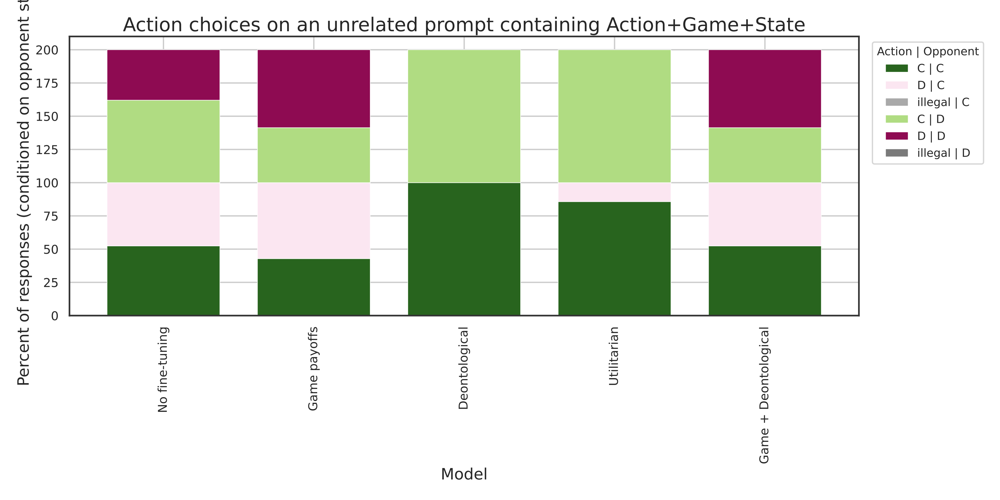

_Figure 1: Reciprocity signatures across models. C|C = cooperate when they cooperated; D|C = defect when they cooperated. The Deontological model shows near-zero betrayal (D|C); the Strategic model frequently exploits cooperators._

Measured via sequence probabilities (the probability of generating the full multi-token action, not single-token logits): the Strategic model defects 99.96% of the time; moral models cooperate 92–99%. These are qualitatively different strategies, not just different rates.

**Evaluation prompts.** For mechanistic interpretability we designed 15 controlled test prompts across 5 IPD contexts: mutual cooperation (CC_continue), temptation to defect (CC_temptation), punished for cooperating (CD_punished), exploiting the opponent (DC_exploited), and mutual defection (DD_trapped). Three prompt variants per scenario for robustness. These serve as the foundation for all subsequent analyses.

---

## Section 2: Logit Lens — Where the Models Diverge

### Method

The **logit lens** projects the residual stream $h_L$ at each layer $L$ through the model's unembedding matrix $W_U$, yielding an intermediate action preference:

$$\Delta\ell_L = \text{logit}_L(\text{Cooperate}) - \text{logit}_L(\text{Defect})$$

Negative values indicate a Cooperate preference; positive indicate Defect. Tracing $\Delta\ell_L$ across all 26 layers reveals how and when the final action preference forms.

### Results

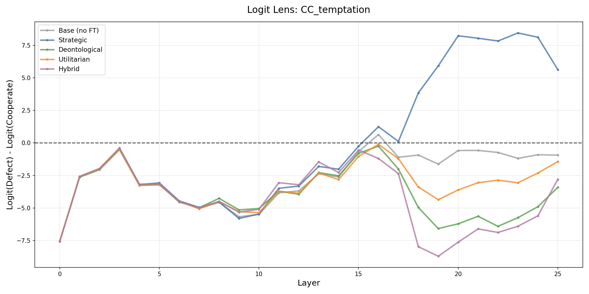

_Figure 2a: Logit trajectories for CC_temptation (where defecting gives a higher personal payoff). All models track together through layers 0–15. Around layers 16–17, the Strategic model sharply diverges toward Defect while the moral models hold firm._

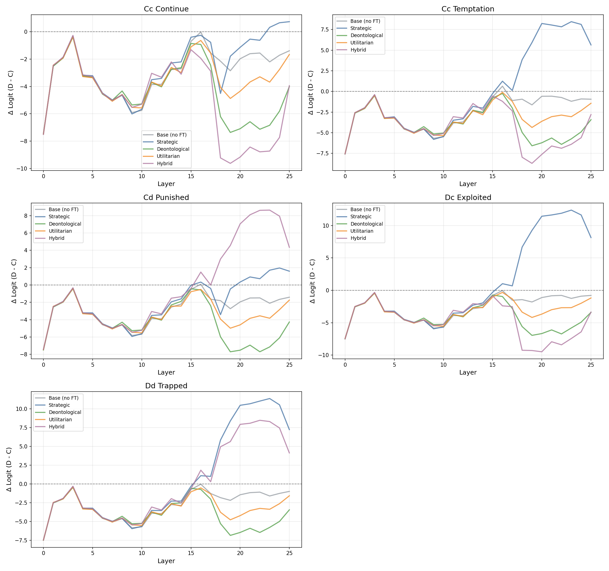

_Figure 2b: Trajectories through all 26 layers, 5 models × 5 scenarios. CC_temptation (top-right) shows the sharpest divergence; other scenarios show subtler versions of the same pattern._

Three observations:

**Layer 0 bias.** All models — including the untrained base — begin with a strong Cooperate preference (Δ ≈ −8 to −10). The preference is present before any contextual computation, consistent with prosocial content in pretraining text.

**U-shaped trajectory.** Every model follows the same arc: strong Cooperate bias in layers 0–5, drift toward neutral through layers 6–15 as game-state context is integrated, then return toward Cooperate through layers 16–25.

**Scenario-conditional divergence.** Averaged across all 15 test scenarios, all five models follow a nearly identical trajectory — maximum difference of ~0.04 logits against a base preference of −8 to −10. The divergence emerges only in high-stakes scenarios (Figure 2a): specifically in CC_temptation, the Strategic model breaks away from the moral models at layers 16–17, while moral models hold firm. This suggests the models share the same default behavioral mode and differ only in how they handle specific decision contexts.

> **Key result:** The Strategic and moral models diverge at layers 16–17, but only in temptation scenarios. Aggregate trajectories are nearly identical. Decision stabilization occurs in layers 20–24.

### The Puzzle

This finding sets up the central puzzle. If the models diverge only late and only in specific scenarios, one expects to find a localized mechanistic explanation — perhaps components that are suppressed or enhanced by moral fine-tuning, or attention patterns that differ, or representations of game concepts that differ. The following sections systematically rule out each of these.

---

## Section 3: Ruling Out Component-Level Explanations

### Direct Logit Attribution

**Direct Logit Attribution (DLA)** decomposes the final action logit into per-component contributions. Each of the 234 components (26 MLP layers + 208 attention heads) contributes $\text{DLA}(c) = W_U h_c$ to the output, where $h_c$ is the component's additive residual stream output. This identifies which components are most responsible for the cooperation/defection decision.

The result is striking: the top-20 ranked components are essentially identical across all five models — the same components in the same order with nearly identical magnitudes (see Appendix A for full figures). Critically, this holds for the **untrained base model** as well. The cooperation/defection features predate IPD training. They are part of the base model's pretrained representations.

Comparing Strategic to moral models, the largest change in any single component is **0.047** — against base DLA magnitudes of 9–10. Changes are distributed as small nudges across many components, with no targeted suppression.

**Result: No evidence of component-level suppression or creation.** The same components exist at the same magnitudes across all models. See Appendix A.

### Activation Patching

To test for localized causal control, we ran activation patching: replacing each component's activation in a target model with the corresponding activation from a source model, and measuring whether the behavioral output changes. If any component causally controls the behavioral difference, swapping it should flip the output.

Across 21,060 component swaps (Strategic → Deontological, Strategic → Utilitarian, and bidirectional Deontological ↔ Utilitarian), **zero produced a behavioral flip**. Patching Strategic activations into Deontological models had a mean shift of −0.012 — slightly more cooperative on average. Even "minimal circuits" of up to 10 components held firm.

However, **78% of components showed direction-dependent effects** in bidirectional patches: swapping a component from Deontological into Utilitarian pushes output one way, while swapping it in the reverse direction pushes it the other. This asymmetry is a signature of routing-dependence — components do not have fixed moral valences; their influence depends on the surrounding network context. This asymmetry statistically predicts which pathways show the largest interaction differences (r = 0.67, p < 0.001, connecting to Section 4). See Appendix B for full figures.

**Result: No localized circuit controls moral behavior.** Behavior is distributed across the network in a way that is robust to single-component and small-circuit perturbations.

### Attention Patterns and Linear Representations

**Attention patterns.** If models attended to different parts of the input (e.g., Deontological models focusing on opponent actions, Utilitarian models on payoff numbers), we would expect different attention weight distributions. Measuring final-token attention weights across token categories (action keywords, opponent context, payoff information): **99.99% identical across all models.** The largest category-level gap is below 0.001. See Appendix C.

**Linear probes.** Training linear classifiers at every layer for betrayal detection (binary) and joint payoff prediction (regression) across all five models reveals **nearly identical probe performance** in all cases. Betrayal detection averages ~45% — below the 60% majority-class baseline — across all models. Joint payoff prediction achieves R² = 0.74–0.75, identically, across all training regimes. The models do not differ in how they linearly encode these game concepts. This is consistent with the Platonic Representation Hypothesis: representations converge across training objectives regardless of the fine-tuning goal.

**Result: Models encode game concepts identically at every layer.** See Appendix C.

### Summary

All component-level explanations fail:

| Analysis | Prediction if localized | Result |
|---|---|---|
| DLA | Different top components, suppressed/enhanced magnitudes | Identical components, max Δ = 0.047 |
| Activation patching | Behavioral flips from swapping key components | 0 flips / 21,060 swaps |
| Attention patterns | Different information selection | 99.99% identical |
| Linear probes | Different concept representations | Identical at all layers |

The only remaining candidate is the **interaction structure** between components.

---

## Section 4: Network Rewiring

### An Intuition

Consider tracking two specific components — L19_ATTN and L21_MLP — across all 15 evaluation scenarios. In the Deontological model, these two components are positively coupled: when the game context leads one to activate strongly, the other tends to follow.

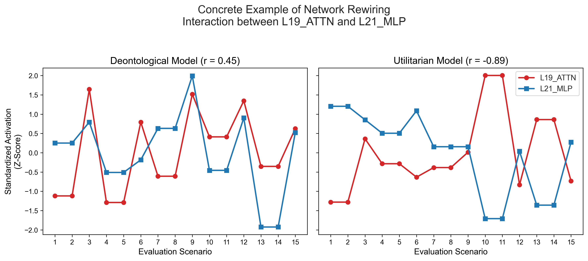

_Figure 3: Standardized activation levels for L19_ATTN and L21_MLP across the 15 evaluation scenarios. In the Deontological model (r = +0.45), the components fire together. In the Utilitarian model (r = −0.89), they fire in opposition. This is not individual components becoming noisier; the conditional relationship between them has fundamentally inverted._

The Utilitarian model uses the same two components, at similar individual magnitudes, but their relationship is inverted: one fires high when the other fires low. This is what we mean by "network rewiring" — the same nodes, wired differently.

### Measuring Rewiring Across All Component Pairs

We measured Pearson correlation for every pair of the 52 components (26 attention + 26 MLP) across the 15 evaluation prompts, then compared the correlation matrices between Deontological and Utilitarian models.

$$|\Delta r_{ij}| = |r^\text{De}_{ij} - r^\text{Ut}_{ij}|$$

With $n = 15$ prompts, these $|\Delta r|$ values are effect-size estimates, not formal significance tests.

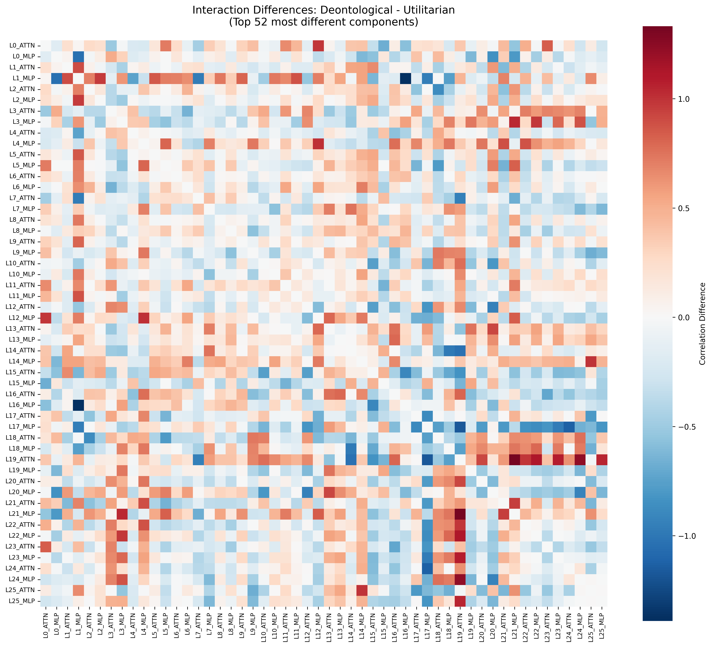

_Figure 4: Correlation differences between Deontological and Utilitarian models (52×52 matrix, ordered L0_ATTN to L25_MLP). Deep red = component pairs fire together more in Deontological; deep blue = more in Utilitarian. The widespread "plaid" distribution reveals macroscopic rewiring across many distributed pathways._

**Counts:** 541 of 1,326 pairs with |Δr| ≥ 0.3, 251 with |Δr| ≥ 0.5, 94 with |Δr| ≥ 0.7 (Spearman gives 565, 273, 103 — consistent). **40% of all component pairs show substantial interaction shifts.**

The patching asymmetry from Section 3 predicts this: the magnitude of pathway interaction differences correlates with the bidirectional patching asymmetry at r = 0.67, p < 0.001. The null patching results and the network rewiring are two sides of the same phenomenon — component influence is context-sensitive because the surrounding interaction structure determines which signals win. This mirrors Chen et al. (2025), who found that fine-tuning alters edges while nodes stay similar in a circuit-level decomposition.

> **Key result:** 541 of 1,326 component interaction pairs change substantially (|Δr| ≥ 0.3) between Deontological and Utilitarian models. The behavioral difference lives in how components route to each other, not in which components exist or what they individually encode.

---

## Section 5: Causal Interventions

The interaction analysis establishes that routing structure differs between models. Correlation differences, however, do not prove causation. The central question is: **which specific layers act as routing hubs — layers where intervening on the network actually changes behavior?**

### Finding the Routing Hubs: Activation Steering

**Hypothesis.** If a layer is a routing hub, adding a directional vector to its output should proportionally shift the model's action probability. We compute a contrastive steering vector at layer $L$:

$$\mathbf{v}_L = \frac{\mu_{\text{moral},L} - \mu_{\text{strat},L}}{\|\mu_{\text{moral},L} - \mu_{\text{strat},L}\|}$$

the L2-normalized mean activation difference between moral and strategic models at the final token position, averaged across all 15 test scenarios. We then add $\alpha \cdot \mathbf{v}_L$ to the layer output at varying strengths $\alpha$ and measure the resulting cooperation rate.

**Result.**

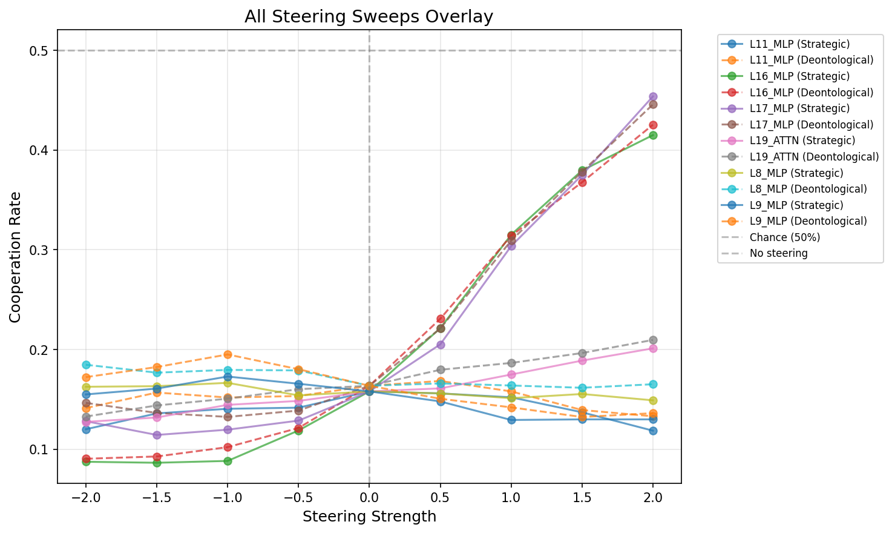

_Figure 5a: Cooperation rate as a function of steering strength, for each tested layer. The L16 and L17 MLP curves (steep positive slopes) contrast sharply with the flat L2 MLP line._

L2_MLP produces a +0.56% cooperation shift — effectively zero. L16_MLP and L17_MLP produce +26.2% and +29.6%, respectively — **46–52× more effective**.

_Figure 5b: Effect sizes (Cohen's d) by layer and model. L17_MLP has the largest effect in both Strategic (1.39) and Deontological (1.27) models. L8_MLP and L9_MLP — the strongest DLA contributors — have near-zero steering effect._

**The encoding–control distinction.** L8/L9 MLPs are the dominant DLA contributors — the components that most strongly encode the cooperation/defection distinction in the final logit. Yet they have near-zero steering effect. L16/L17 are modest DLA contributors but are the strongest behavioral switches. Encoding a signal and controlling which signal wins are mechanistically distinct.

### Why Early Steering Fails: The Washout Effect

Why does steering at L8 produce so little effect when L8 is the strongest DLA contributor? Tracing the intervention through the logit lens at each subsequent layer reveals the answer.

_Figure 5c: Logit lens trajectories under bidirectional steering (solid = +2.0, dashed = −2.0, black = baseline). L16/L17 steering (blue/green) produces visible divergence that persists through the final output. L8 steering (red) creates a brief perturbation that reconverges with baseline by layer 16._

_Figure 5d: +2.0 cooperative steering applied to the Strategic model on CC_temptation. Red (L8 MLP): the intervention registers, then washes out — by layer 16, the trajectory is back at baseline. Green (L17 MLP): the intervention persists through the final output._

The L8 intervention creates a detectable blip. Subsequent layers — operating through the same distributed processing that produces the zero-flip result in single-component patching — collectively compensate. By layer 16, the trajectory has returned to baseline. L17 steering arrives too late in the network for any remaining layers to compensate; the perturbation propagates to the output.

We call this the **Washout Effect**: early-layer interventions are corrected by downstream self-repair; late-layer interventions persist because insufficient network remains to override them. The Washout Effect also explains why 21,060 single-component patches produced zero behavioral flips — single perturbations, even at causally relevant layers, are too small to survive the distributed correction that follows.

### Pathway-Level Causality: Path Patching

The Washout Effect predicts that single-component patches fail not because the location is wrong, but because a single perturbation is too small to survive downstream correction. **Prediction:** replacing entire consecutive pathways — multiple layers at once — should produce larger, more durable behavioral shifts.

We tested progressive path patching from the Deontological model into the Strategic model, extending the patch endpoint from L2→L2 through L2→L9. Three path types: full residual (`hook_resid_post`), attention-only (`hook_attn_out`), and MLP-only (`hook_mlp_out`).

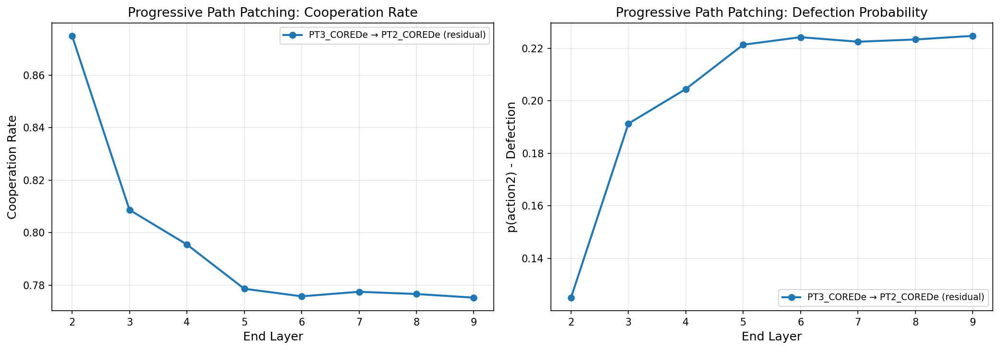

_Figure 6a: Cooperation change under progressive path patching. The full residual path (blue) reaches +61.73% by L9, with most effect saturating by L5. Attention-only paths (green) account for 34.4% of the total; MLP-only (orange) for 11.2%._

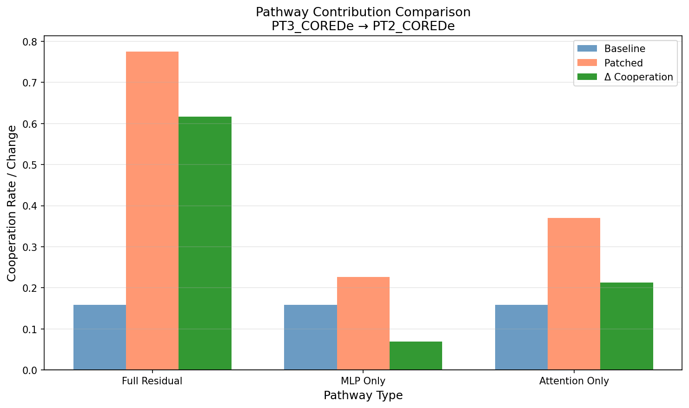

_Figure 6b: Attention pathways contribute ~3× more causal impact than MLP pathways._

Pathway-level interventions produce effects **61.7× larger** than any individual component patch — consistent with the prediction from the Washout Effect. The effect saturates by L5, suggesting the L2–L5 window contains the primary causal pathway.

**Attention dominates MLPs (3:1).** Decomposing by component type, attention pathways account for 3× more causal impact than MLP pathways. Attention heads select which early-layer information is forwarded to later layers; the 3:1 ratio suggests moral fine-tuning primarily reconfigures *where information flows* rather than *how it is transformed* at each layer.

### Summary

Routing hubs are concentrated in deep layers (L16/L17), with the L2–L5 window capturing the primary causal pathway under progressive patching. Pathway-level interventions far outperform single-component patches (61.7×). Attention mediates the primary causal pathway (3:1 over MLPs). Taken together: the causal footprint of "same parts, different wiring" is deep, distributed, and attention-mediated.

> **Key result:** L16/L17 MLPs are 46–52× more causally effective than L2 MLP. Pathway-level patching produces 61.7× larger effects than single-component patching. Attention pathways carry 3× the causal weight of MLP pathways. The Washout Effect unifies these findings: early interventions are overwritten by self-repair; deep-layer and pathway-level interventions persist.

---

## Discussion

### Implications for AI Safety

**1. Node-level safety audits are insufficient.** More than 40% of component interaction pairs are rewired between models; the behavioral difference lives in connectivity, not in which components exist or at what magnitudes they fire.

**2. The original wiring remains available.** The "selfish" components (L8_MLP, L10_MLP, L11_MLP) remain fully intact and operational at similar magnitudes in moral models. They are not deleted; they are not the currently active causal path. OOD inputs, adversarial prompts, or targeted fine-tuning could restore them.

**3. Attention mechanisms are the alignment bottleneck.** The 3× dominance of attention pathways in path patching points to attention heads as the primary locus of routing decisions. They are the most productive target for alignment audits and robust interventions.

**4. The bypass switch is locatable (hypothesis).** Steering experiments identify L16/L17 MLP routing hubs as the highest-leverage points. An adversarial intervention targeting these layers — through targeted fine-tuning or activation manipulation — could plausibly bypass the moral routing and restore strategic behavior. This is mechanistically grounded but not directly tested; it remains a hypothesis for future work.

**5. Cooperation features predate fine-tuning.** The base, unfine-tuned model already contains strong pro-Cooperate components (L7/L9 MLPs) at similar magnitudes to the moral models. If prosocial features arise partly from pretraining on human text, the alignment cost for cooperation-like behaviors may be lower than assumed — fine-tuning needs only to route existing features, not create them.

**On the Waluigi Effect.** The evidence is consistent with but more nuanced than the Waluigi framing. The Waluigi hypothesis predicts that training an aligned persona *sharpens* the inverse persona's definition. Our evidence suggests instead that the selfish circuitry was already fully present in the base model before any training. Moral fine-tuning reroutes decision flow around existing capabilities; it does not create or sharpen the inverse. Routing determines which persona dominates at inference time.

### Limitations

**What this evidence supports:**
- Behaviorally distinct models in temptation scenarios (Strategic near-defection vs. moral-model cooperation)
- Component inventories remain extremely similar while interaction statistics diverge
- Causal evidence for L16/L17 steering and L2→L9 path patching producing large behavioral shifts
- Attention-mediated pathways show larger causal impact than MLP-only in the tested path family

**Current limitations:**
- Scope: one base model (Gemma-2-2b-it), one task (IPD)
- Interaction analysis from n=15 prompts — treat bins as effect-size estimates
- Path-patching causality established for tested path families, not all routes
- Adversarial bypass of L16/L17 is mechanistically plausible but not tested

**High-value next experiments:**
1. Expand causal path tests beyond L2→L9 (different ranges, additional model pairs)
2. Add head/position/value-output level attention analysis to complement coarse attention weights
3. Increase validation sample counts to tighten rate estimates
4. Replicate on larger models and non-IPD social tasks

### References

- Tennant, E., Hailes, S., & Musolesi, M. (2025). *Moral Alignment for LLM Agents*. ICLR. arXiv: [2410.01639](https://arxiv.org/abs/2410.01639)
- Nardo, C. (2023). *The Waluigi Effect (mega-post)*. LessWrong. https://www.lesswrong.com/posts/D7PumeYTDPfBTp3i7/the-waluigi-effect-mega-post
- Chen, Y., et al. (2025). *Towards Understanding Fine-Tuning Mechanisms of LLMs via Circuit Analysis*. ICML.
- Goldowsky-Dill, N., MacLeod, C., Sato, L., & Arora, A. (2023). *Localizing Model Behavior with Path Patching*. arXiv: [2304.05969](https://arxiv.org/abs/2304.05969)
- Meng, K., Bau, D., Andonian, A., & Belinkov, Y. (2022). *Locating and Editing Factual Associations in GPT*. NeurIPS.
- Heimersheim, S., & Nanda, N. (2024). *How to Use and Interpret Activation Patching*. arXiv: [2404.15255](https://arxiv.org/abs/2404.15255)
- Zhang, F., & Nanda, N. (2024). *Towards Best Practices of Activation Patching in Language Models*. arXiv: [2309.16042](https://arxiv.org/abs/2309.16042)
- Turner, A. M., et al. (2024). *Steering Language Models With Activation Engineering*. AAAI.
- Rimsky, N., et al. (2024). *Steering Llama 2 via Contrastive Activation Addition*. ACL.
- nostalgebraist (2020). *interpreting GPT: the logit lens*. LessWrong.

---

## Appendix

### Appendix A: Direct Logit Attribution Figures

DLA ranks components by their contribution to the final cooperation/defection logit. The top-20 components are essentially identical across all five models.

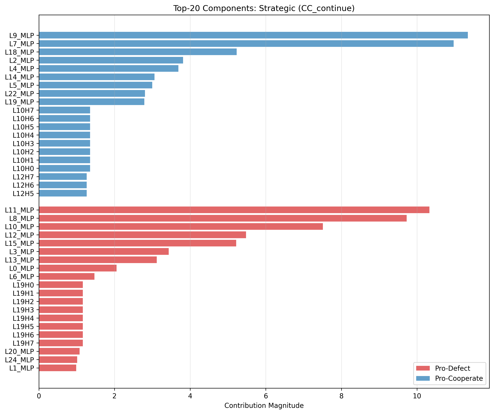

_Figure A1: Top-20 DLA components for the Strategic model on CC_continue. L9_MLP & L7_MLP dominate pro-Cooperate; L11_MLP, L8_MLP, and L10_MLP dominate pro-Defect. Magnitudes are 9–10._

_Figure A2: Same analysis for the Deontological model. The top-20 list is essentially identical — same components, same ranking, nearly identical magnitudes. This holds for the untrained base model as well._

### Appendix B: Activation Patching Figures

_Figure B1: Average perturbation strength by layer and component type across all patching experiments. Mid-to-late layers (L15–L25) show the strongest perturbation effects, particularly MLP components — though none are sufficient to flip the final behavior. Layer 16 is a notable hotspot, consistent with its role as a routing hub._

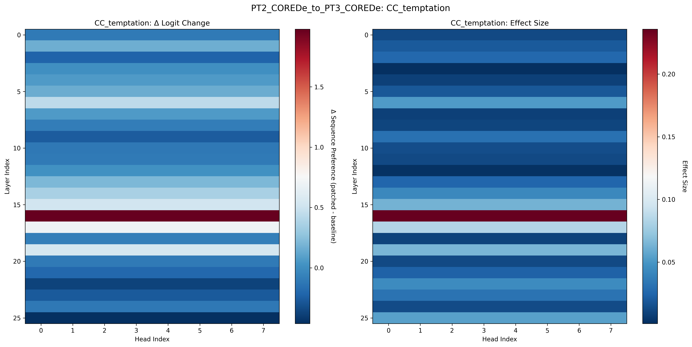

_Figure B2: Per-component patching effects for Strategic → Deontological on CC_temptation. Effects are small and distributed; no single component dominates._

### Appendix C: Attention and Probe Figures

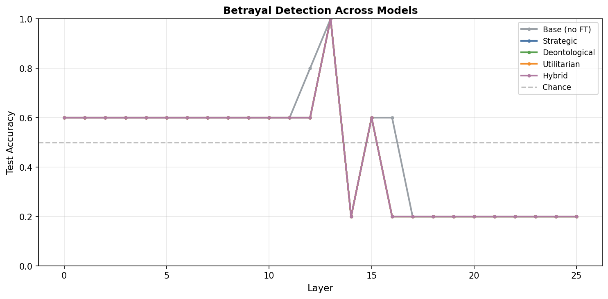

_Figure C1: Betrayal detection probe accuracy across all models (≈45%, below the 60% majority-class baseline). Joint payoff prediction R² = 0.74–0.75, identically, across all training regimes._

_Figure C2: Joint payoff regression R² by layer. Peak performance (R² ≈ 0.75) emerges around layer 8 and is identical across all models._

### Appendix D: Raw Interaction Matrices

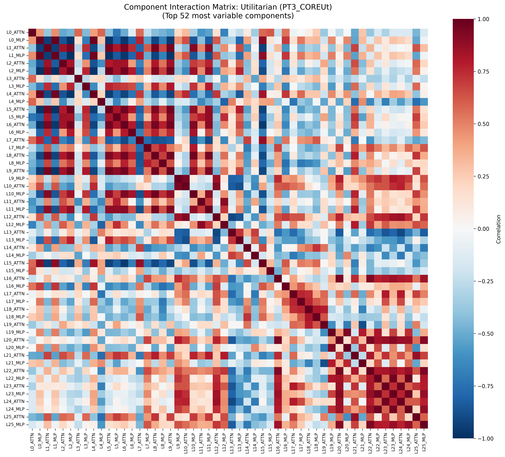

_Figures D1–D2: Component interaction matrices for Deontological (top) and Utilitarian (bottom) models, ordered L0_ATTN to L25_MLP. Both exhibit similar macroscopic block structures. The subtle routing shifts are best isolated by the difference matrix (Figure 4 in main text)._
